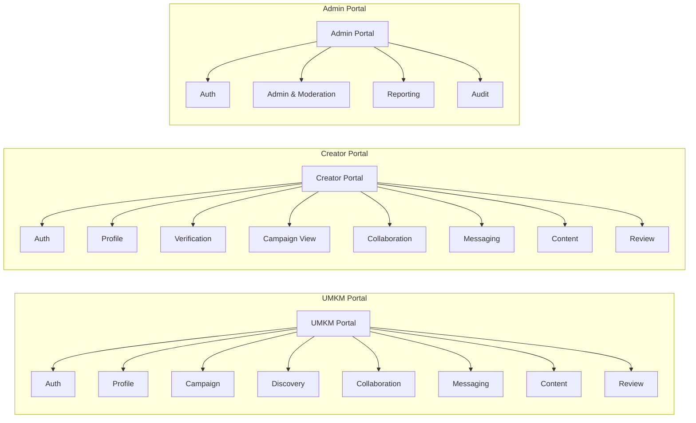

# Component Diagram — Collabite

> **Versi:** 1.0 (Approved)
> **Tanggal:** 2026-06-18
> **Status:** Disetujui sebagai acuan implementasi M0–M7.

Dokumen ini menjabarkan arsitektur komponen aplikasi Collabite berdasarkan use case di [USE_CASE.md](./USE_CASE.md) dan stack teknis di PRD.

Prinsip utama: **dependensi tidak boleh merepresentasikan urutan proses bisnis**. Setiap portal (UMKM, Creator, Admin) memakai modul-modul core secara independen sesuai kebutuhannya, bukan sebagai "rantai".

---

## Diagram Komponen (Mermaid)

```mermaid
flowchart TB
    subgraph PL [Presentation Layer]
        direction TB
        UI_PUB[Public Website<br/>Halaman publik, landing]
        UI_UMKM[UMKM Portal<br/>React + Inertia]
        UI_CRE[Creator Portal<br/>React + Inertia]
        UI_ADM[Admin Portal<br/>React + Inertia]
        SHARED[Shared React Components<br/>shadcn/ui + Tailwind]
        INERTIA_C[Inertia Client<br/>@inertiajs/react]
    end

    subgraph LW [Laravel Web Layer]
        direction TB
        ROUTES[Web Routes<br/>routes/web.php]
        MW[Middleware<br/>auth, verified, role]
        CTRL[Controllers]
        FR[Form Requests<br/>Validasi input]
        POL[Authorization Policies<br/>Laravel Policies]
        INERTIA_S[Inertia Laravel Adapter<br/>Inertia::render]
    end

    subgraph CM [Core Modules]
        direction TB
        MOD_AUTH[Authentication & Account]
        MOD_PROF[Profile & Portfolio]
        MOD_VERIF[Creator Verification]
        MOD_CAMP[Campaign Management]
        MOD_DISC[Creator Discovery]
        MOD_COLLAB[Collaboration Management]
        MOD_MSG[Messaging]
        MOD_CONT[Content & Progress]
        MOD_REV[Rating & Review]
        MOD_ADMIN[Admin & Moderation]
        MOD_NOTIF[Notification]
        MOD_AUDIT[Audit & Activity]
        MOD_REP[Reporting & Monitoring]
    end

    subgraph INF [Infrastructure]
        direction TB
        ELO[Eloquent Persistence]
        DB[(MySQL Database)]
        FS[File Storage<br/>public + private disks]
        Q[Database Queue<br/>jobs table]
        MAIL[Mail Service<br/>SMTP / log driver]
        SCHED[Scheduler<br/>Artisan kernel]
    end

    UI_PUB --> INERTIA_C
    UI_UMKM --> INERTIA_C
    UI_CRE --> INERTIA_C
    UI_ADM --> INERTIA_C
    UI_UMKM --> SHARED
    UI_CRE --> SHARED
    UI_ADM --> SHARED

    INERTIA_C -->|HTTP XHR| ROUTES
    ROUTES --> MW
    MW --> CTRL
    CTRL --> FR
    CTRL --> POL
    CTRL --> INERTIA_S
    INERTIA_S -->|Inertia::render| INERTIA_C

    UI_UMKM -.uses.-> MOD_AUTH
    UI_UMKM -.uses.-> MOD_PROF
    UI_UMKM -.uses.-> MOD_CAMP
    UI_UMKM -.uses.-> MOD_DISC
    UI_UMKM -.uses.-> MOD_COLLAB
    UI_UMKM -.uses.-> MOD_MSG
    UI_UMKM -.uses.-> MOD_CONT
    UI_UMKM -.uses.-> MOD_REV

    UI_CRE -.uses.-> MOD_AUTH
    UI_CRE -.uses.-> MOD_PROF
    UI_CRE -.uses.-> MOD_VERIF
    UI_CRE -.uses.-> MOD_CAMP
    UI_CRE -.uses.-> MOD_COLLAB
    UI_CRE -.uses.-> MOD_MSG
    UI_CRE -.uses.-> MOD_CONT
    UI_CRE -.uses.-> MOD_REV

    UI_ADM -.uses.-> MOD_AUTH
    UI_ADM -.uses.-> MOD_ADMIN
    UI_ADM -.uses.-> MOD_VERIF
    UI_ADM -.uses.-> MOD_REP
    UI_ADM -.uses.-> MOD_AUDIT

    CTRL --> MOD_AUTH
    CTRL --> MOD_PROF
    CTRL --> MOD_VERIF
    CTRL --> MOD_CAMP
    CTRL --> MOD_DISC
    CTRL --> MOD_COLLAB
    CTRL --> MOD_MSG
    CTRL --> MOD_CONT
    CTRL --> MOD_REV
    CTRL --> MOD_ADMIN
    CTRL --> MOD_NOTIF
    CTRL --> MOD_AUDIT
    CTRL --> MOD_REP

    MOD_AUTH --> ELO
    MOD_PROF --> ELO
    MOD_PROF --> FS
    MOD_VERIF --> ELO
    MOD_VERIF --> FS
    MOD_CAMP --> ELO
    MOD_DISC --> ELO
    MOD_COLLAB --> ELO
    MOD_MSG --> ELO
    MOD_MSG --> FS
    MOD_CONT --> ELO
    MOD_CONT --> FS
    MOD_REV --> ELO
    MOD_ADMIN --> ELO
    MOD_NOTIF --> ELO
    MOD_NOTIF --> Q
    MOD_NOTIF --> MAIL
    MOD_AUDIT --> ELO
    MOD_REP --> ELO

    ELO --> DB
    FS --> DB
    Q --> DB

    SCHED --> MOD_AUDIT
    SCHED --> MOD_REP
```

> **Catatan dependensi:** Modul core (`MOD_*`) berdiri sendiri; dependensi antarmodul hanya jika diperlukan secara domain (mis. `MOD_CONT` mengirim event `MOD_NOTIF`). Diagram tidak menunjukkan urutan proses bisnis (mis. `MOD_AUTH → MOD_PROF → MOD_CAMP`). Setiap portal (`UMKM/Creator/Admin`) memilih modul yang relevan secara langsung.

---

## Diagram Sederhana per Portal (Relasi Independen)

> Diagram ini menekankan bahwa setiap portal memakai modul secara **independen** — tidak ada keharusan UMKM → Auth → Campaign → Discovery → Collaboration.

---

## Komponen & Tanggung Jawab

### Presentation Layer

#### Layout Shells (frontend architecture)

- **Tanggung jawab:** Shell per peran yang membungkus seluruh halaman Inertia. Pemisahan eksplisit sesuai [ADR-031](./DECISIONS.md#adr-031--role-specific-layout-shells-admin-dashboard-vs-marketplace).
- **Interface & lokasi:**
  - `resources/js/layouts/PublicLayout.tsx` — landing, direktori publik, halaman marketing.
  - `resources/js/layouts/AuthLayout.tsx` — login, register, lupa password, verifikasi.
  - `resources/js/layouts/MarketplaceLayout.tsx` — UMKM & Creator terautentikasi; top navbar dengan role-specific navigation, search opsional, user menu, mobile sheet, dan bottom navigation.
  - `resources/js/layouts/AdminDashboardLayout.tsx` — Admin saja; sidebar persisten + breadcrumb + tabel ringkas.
  - `resources/js/layouts/CollaborationWorkspaceLayout.tsx` — workspace kolaborasi UMKM/Creator dengan header, badge status, dan tab Pesan/Progres/Submission/Review.
  - Sumber kebenaran navigasi: `resources/js/config/navigation.ts` (`NavigationItem[]` per peran + `PrimaryAction`).
  - Pemilihan layout terjadi di `resources/js/app.tsx` berdasarkan prefix nama page (`Admin/`, `Umkm/`, `Creator/`, `auth/`, `Public/`, `settings/`).
- **Dependency:** `Shared React Components` (shadcn/ui), `Inertia Client`.
- **Data yang dikelola:** Auth context, role flag, breadcrumbs opsional.
- **Requirement terkait:** NFR-ACCESSIBILITY-001, FR-UI-CONSISTENCY.

#### Public Website
- **Tanggung jawab:** Halaman statis/dinamis untuk publik (landing, halaman profil Creator/UMKM publik, kebijakan privasi).
- **Interface:** Inertia pages di `resources/js/pages/public/*`.
- **Dependency:** `Shared React Components`, `Inertia Client`.
- **Data yang dikelola:** Tidak ada; hanya membaca via controller publik.
- **Requirement terkait:** FR-DISCOVERY-003, FR-DISCOVERY-004, FR-REVIEW-004.

#### UMKM Portal
- **Tanggung jawab:** Halaman Inertia khusus UMKM.
- **Interface:** `resources/js/pages/umkm/*`.
- **Dependency:** `Shared Components`, `Inertia Client`, dan modul `Auth`, `Profile`, `Campaign`, `Discovery`, `Collaboration`, `Messaging`, `Content`, `Review`.
- **Data yang dikelola:** State UI (form, daftar, pagination).
- **Requirement terkait:** Seluruh FR untuk peran UMKM.

#### Creator Portal
- **Tanggung jawab:** Halaman Inertia khusus Creator.
- **Interface:** `resources/js/pages/creator/*`.
- **Dependency:** Sama dengan UMKM, ditambah `Verification`.
- **Data yang dikelola:** State UI.
- **Requirement terkait:** Seluruh FR untuk peran Creator.

#### Admin Portal
- **Tanggung jawab:** Halaman Inertia khusus Admin.
- **Interface:** `resources/js/pages/admin/*`.
- **Dependency:** `Auth`, `Admin & Moderation`, `Reporting`, `Audit`.
- **Data yang dikelola:** State UI.
- **Requirement terkait:** Seluruh FR Admin.

##### Admin Collaboration Oversight (UC-ADMIN-010)
- **Tanggung jawab:** Halaman oversight kolaborasi khusus Admin (`/admin/collaborations`) — list & detail semua kolaborasi lintas UMKM/Creator; tombol force-close dengan reason validation.
- **Interface:** `resources/js/pages/Admin/Collaborations/Index.tsx` & `Show.tsx`; backend `app/Http/Controllers/Admin/CollaborationsController.php` + `app/Actions/Admin/ForceCloseCollaborationAction.php`; request `app/Http/Requests/Admin/ForceCloseCollaborationRequest.php`; notifikasi `app/Notifications/CollaborationForceClosedNotification.php`.
- **Route:** `GET /admin/collaborations`, `GET /admin/collaborations/{collaboration}`, `POST /admin/collaborations/{collaboration}/force-close`.
- **Dependency:** `Admin & Moderation`, Audit, Notification, `app/Policies/CollaborationPolicy.php` (Admin ditolak akses rute UMKM/Creator → 403).
- **Data yang dikelola:** Status `collaborations.cancelled_*` (FK `cancelled_by` + `cancelled_reason`).
- **Requirement terkait:** FR-COLLAB-011, FR-AUDIT-001.

#### Shared React Components
- **Tanggung jawab:** UI primitives (button, form, modal, table, dsb.) berbasis shadcn/ui.
- **Interface:** `resources/js/components/ui/*` (default shadcn).
- **Dependency:** Tailwind CSS v4, `@radix-ui/*`.
- **Data yang dikelola:** Props.
- **Requirement terkait:** NFR-ACCESSIBILITY-001.

#### Inertia Client
- **Tanggung jawab:** Routing & data fetching dari server.
- **Interface:** `@inertiajs/react`.
- **Dependency:** Backend Inertia adapter.
- **Data yang dikelola:** Cache halaman, props.

---

### Laravel Web Layer

#### Web Routes
- **Tanggung jawab:** Pemetaan URL → controller/middleware.
- **Interface:** `routes/web.php`.
- **Dependency:** Middleware.
- **Data yang dikelola:** URI, nama route.
- **Requirement terkait:** NFR-SECURITY-002.

#### Middleware
- **Tanggung jawab:** `auth`, `verified`, `role`, `throttle`, `signed`.
- **Interface:** `app/Http/Middleware/*`.
- **Dependency:** Session.
- **Data yang dikelola:** Request state.
- **Requirement terkait:** NFR-SECURITY-002, NFR-SECURITY-006.

#### Controllers
- **Tanggung jawab:** Orkestrasi use case.
- **Interface:** `app/Http/Controllers/*` (struktur `Umkm/`, `Creator/`, `Admin/`, `Public/`).
- **Dependency:** Form Requests, Policies, Inertia adapter, Core Modules.
- **Data yang dikelola:** Response data.
- **Requirement terkait:** Seluruh FR.

#### Form Requests
- **Tanggung jawab:** Validasi input terpusat.
- **Interface:** `app/Http/Requests/*`.
- **Dependency:** Eloquent (untuk validasi `exists`/`unique`).
- **Data yang dikelola:** Validated payload.
- **Requirement terkait:** NFR-SECURITY-005, NFR-MAINTAINABILITY-001.

#### Authorization Policies
- **Tanggung jawab:** Aturan otorisasi per resource.
- **Interface:** `app/Policies/*`.
- **Dependency:** Model.
- **Data yang dikelola:** Boolean keputusan.
- **Requirement terkait:** NFR-SECURITY-003.

#### Inertia Laravel Adapter
- **Tanggung jawab:** Render halaman dengan props.
- **Interface:** `Inertia::render(component, props)`.
- **Dependency:** Inertia Client.
- **Data yang dikelola:** Props.

---

### Core Modules

#### Authentication & Account
- **Tanggung jawab:** Registrasi, login, logout, verifikasi email, reset password, status akun.
- **Interface:** Controller `Auth/*`, `Fortify` features, `App\Services\Auth\*`.
- **Dependency:** Eloquent (`users`), Mail, Notification.
- **Data yang dikelola:** `users`, `sessions`, `password_reset_tokens`.
- **Requirement terkait:** FR-AUTH-001 s/d FR-AUTH-008.

#### Profile & Portfolio
- **Tanggung jawab:** Profil UMKM, produk, profil Creator, keahlian, kategori, portofolio.
- **Interface:** Controller `Profile/*`, `Portfolio/*`.
- **Dependency:** Eloquent, File Storage.
- **Data yang dikelola:** `umkm_profiles`, `products`, `creator_profiles`, `creator_categories`, `creator_skills`, `portfolio_items`, `categories`, `skills`.
- **Requirement terkait:** FR-PROFILE-001 s/d FR-PROFILE-006.

#### Creator Verification
- **Tanggung jawab:** Pengajuan verifikasi, antrian admin, keputusan.
- **Interface:** Controller `Verification/*`, `Admin/Verification/*`.
- **Dependency:** Eloquent, File Storage, Notification.
- **Data yang dikelola:** `creator_verifications`, `creator_verification_documents`.
- **Requirement terkait:** FR-PROFILE-007, FR-PROFILE-008, FR-ADMIN-004.

#### Campaign Management
- **Tanggung jawab:** CRUD campaign, publikasi, pembatalan.
- **Interface:** Controller `Campaign/*`.
- **Dependency:** Eloquent, Authorization.
- **Data yang dikelola:** `campaigns`, `campaign_deliverables`.
- **Requirement terkait:** FR-CAMPAIGN-001 s/d FR-CAMPAIGN-008.

#### Creator Discovery
- **Tanggung jawab:** Pencarian & filter Creator untuk UMKM.
- **Interface:** Controller `Discovery/*` (read-only, query khusus).
- **Dependency:** Eloquent (queries dengan filter & index).
- **Data yang dikelola:** Hasil query Creator.
- **Requirement terkait:** FR-DISCOVERY-001 s/d FR-DISCOVERY-004.

#### Collaboration Management
- **Tanggung jawab:** Request (application/invitation), accept/reject, pembentukan collaboration.
- **Interface:** Controller `Collaboration/*`.
- **Dependency:** Eloquent, Notification.
- **Data yang dikelola:** `collaboration_requests`, `collaborations`.
- **Requirement terkait:** FR-COLLAB-001 s/d FR-COLLAB-010.

#### Messaging
- **Tanggung jawab:** Percakapan dalam kolaborasi.
- **Interface:** Controller `Message/*`.
- **Dependency:** Eloquent, File Storage, Notification.
- **Data yang dikelola:** `conversations`, `messages`, `message_attachments`.
- **Requirement terkait:** FR-MSG-001 s/d FR-MSG-005.

#### Content & Progress
- **Tanggung jawab:** Progress update, content submission, revisi, approval, completion.
- **Interface:** Controller `Content/*`, `Progress/*`.
- **Dependency:** Eloquent, File Storage, Notification.
- **Data yang dikelola:** `collaboration_progress_updates`, `content_submissions`, `content_submission_files`, `content_revisions`.
- **Requirement terkait:** FR-CONTENT-001 s/d FR-CONTENT-008.

#### Rating & Review
- **Tanggung jawab:** Pemberian review, moderasi, agregasi rating.
- **Interface:** Controller `Review/*`, `Admin/Review/*`.
- **Dependency:** Eloquent.
- **Data yang dikelola:** `reviews`.
- **Requirement terkait:** FR-REVIEW-001 s/d FR-REVIEW-005.

#### Admin & Moderation
- **Tanggung jawab:** Dashboard, daftar pengguna, suspend/activate, moderasi campaign/konten/review.
- **Interface:** Controller `Admin/*`.
- **Dependency:** Eloquent, Audit, Reporting.
- **Data yang dikelola:** Status `users`, `campaigns.is_hidden`, `content_submissions.is_hidden`, `reviews.is_hidden`.
- **Requirement terkait:** FR-ADMIN-001 s/d FR-ADMIN-007.

#### Notification
- **Tanggung jawab:** Pengiriman notifikasi in-app + email.
- **Interface:** Listener/Subscriber, Mailable, Notification class.
- **Dependency:** Eloquent (`notifications`), Database Queue, Mail Service.
- **Data yang dikelola:** `notifications`, queue jobs.
- **Requirement terkait:** FR-NOTIF-001, FR-NOTIF-002, FR-NOTIF-003.

#### Audit & Activity
- **Tanggung jawab:** Pencatatan audit log; akses log oleh Admin.
- **Interface:** Service `AuditLogger`, Observer, Controller `Admin/AuditLog/*`.
- **Dependency:** Eloquent.
- **Data yang dikelola:** `activity_logs`.
- **Requirement terkait:** FR-AUDIT-001, FR-AUDIT-002.

#### Reporting & Monitoring
- **Tanggung jawab:** Statistik & ekspor CSV.
- **Interface:** Controller `Admin/Report/*`, Job `GenerateReport`.
- **Dependency:** Eloquent, Queue.
- **Data yang dikelola:** Agregasi read-only.
- **Requirement terkait:** FR-ADMIN-008, FR-ADMIN-009, FR-AUDIT-003, FR-AUDIT-004.

---

### Infrastructure

#### Eloquent Persistence
- **Tanggung jawab:** Akses basis data MySQL.
- **Interface:** Model Eloquent, Query Builder.
- **Dependency:** MySQL.

#### MySQL Database
- **Tanggung jawab:** Penyimpanan data transaksional.
- **Interface:** Driver PDO MySQL.

#### File Storage
- **Tanggung jawab:** Penyimpanan file.
- **Interface:** Disk `public` (portofolio publik, logo), disk `private` (dokumen verifikasi, lampiran pesan, file submission).
- **Dependency:** Filesystem lokal (MVP).

#### Database Queue
- **Tanggung jawab:** Antrian job async (email, ekspor laporan).
- **Interface:** `jobs` table.
- **Dependency:** MySQL.

#### Mail Service
- **Tanggung jawab:** Pengiriman email (SMTP/log).
- **Interface:** `MAIL_*` env.

#### Scheduler
- **Tanggung jawab:** Penjadwalan tugas (cleanup notifikasi, agregasi laporan).
- **Interface:** `app/Console/Kernel.php`.

---

## Catatan Versi

| Versi | Tanggal | Perubahan | Penulis |
| --- | --- | --- | --- |
| 0.1 (Draft) | 2026-06-18 | Initial draft: diagram Mermaid + deskripsi komponen per layer. | Product Engineer |
| 1.0 (Approved) | 2026-06-18 | Tutup OQ-001..OQ-011: admin force-close, message moderation, cancel-collaboration flow, file storage policy. | Product Engineer |
| 1.1 (RC.1 reflection) | 2026-06-18 | RC.1 reflection (no scope change): modul "Admin Collaboration Oversight (UC-ADMIN-010)" ditambahkan ke Admin Portal dengan interface, route, dependency, dan data yang dikelola. | Product Engineer |
