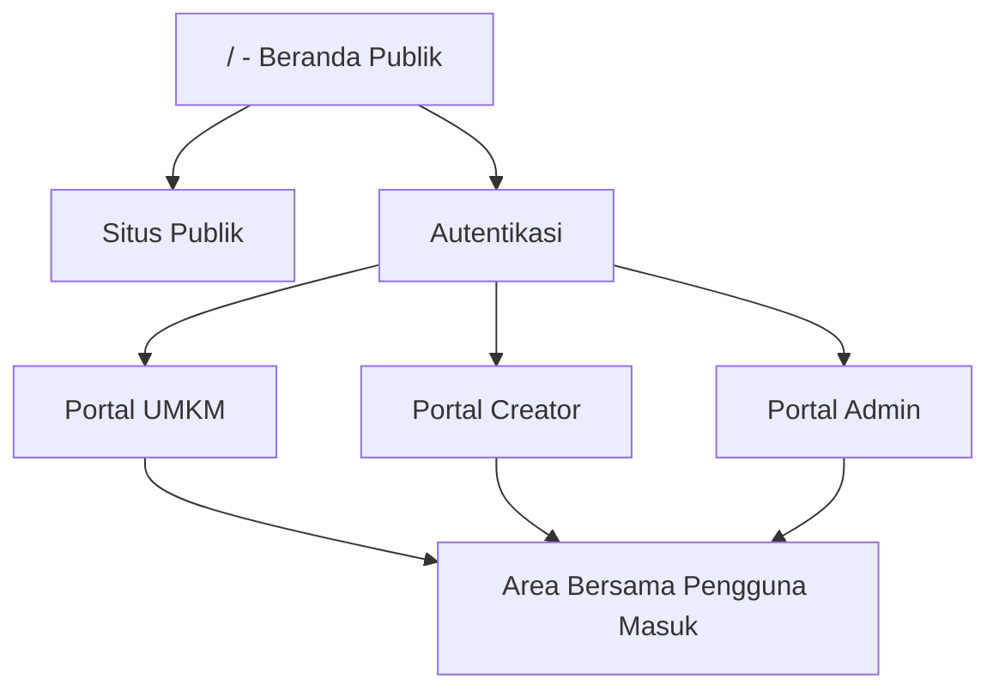
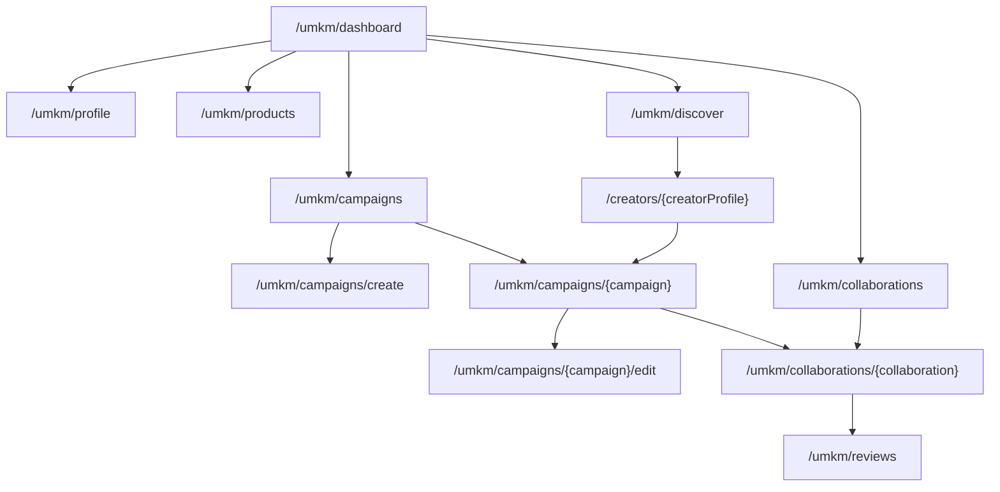
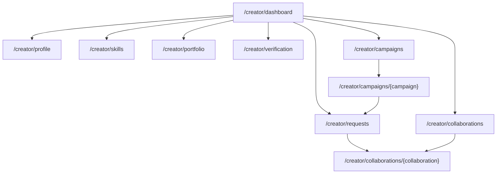
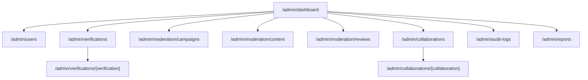
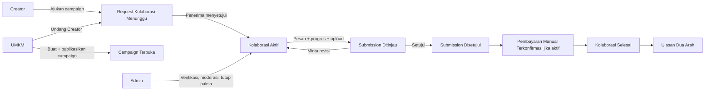
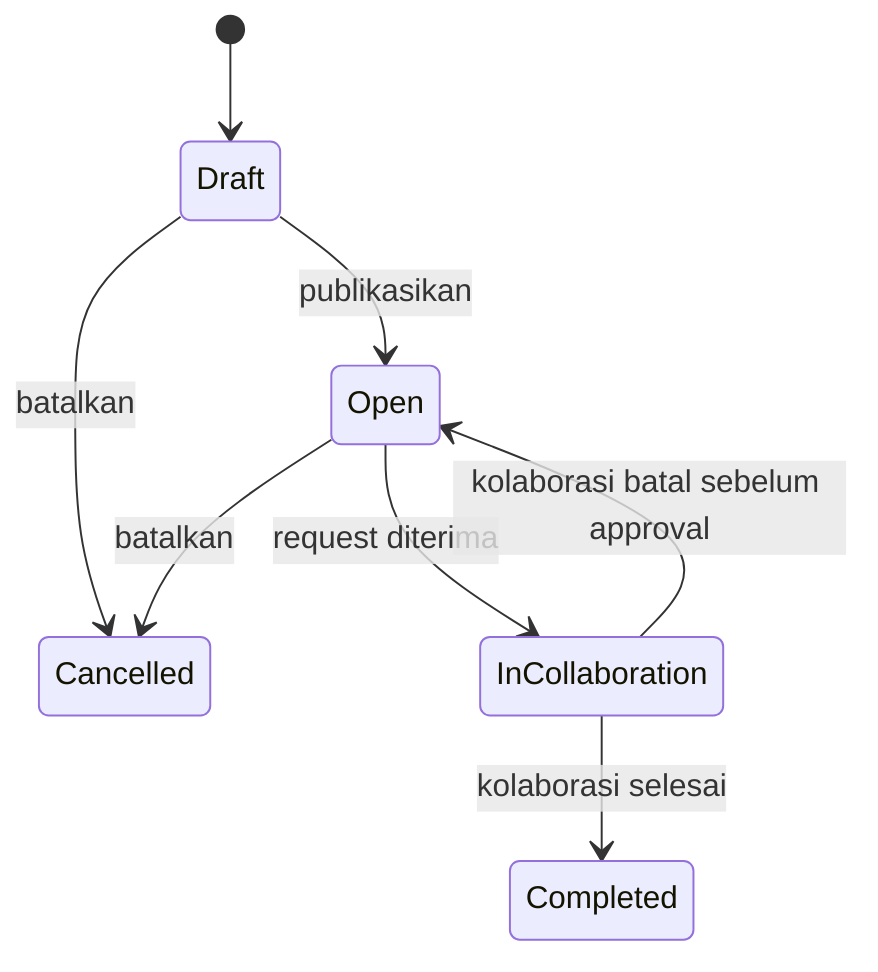
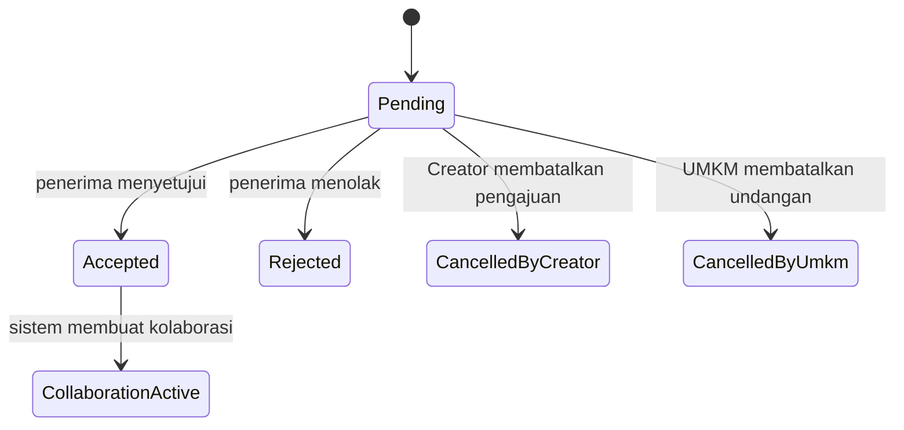
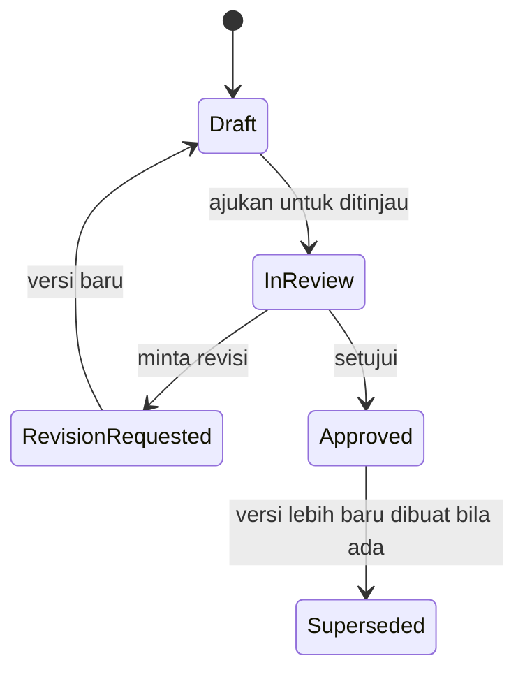
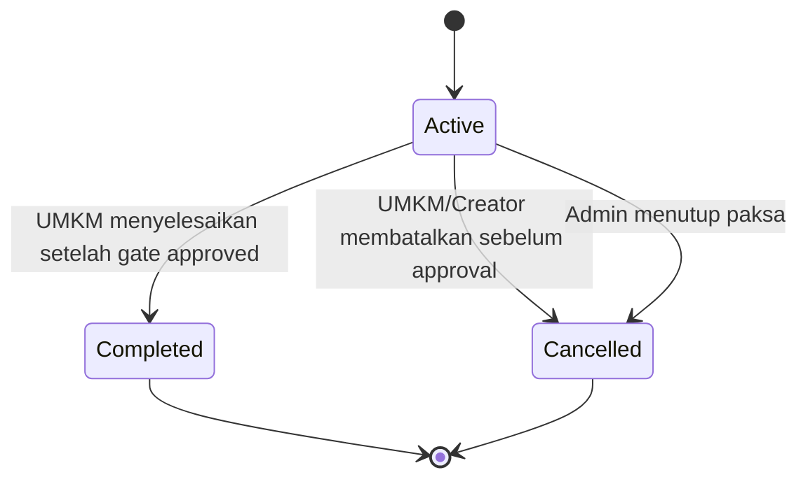

# Cetak Biru UX/UI S2 - Collabite

> Status: Draft operasional untuk serah desain.
> Lingkup: S2.1 Peta Situs Produk, S2.2 Alur Pengguna, S2.4 Sistem Desain UI.
> Basis: PRD, USE_CASE, TDD, COMPONENT_DIAGRAM, TEST_PLAN, IMPLEMENTATION_ROADMAP, DECISIONS, daftar route, dan token desain aktual di `resources/css/app.css`.

---

## 0. Ringkasan

Tim desain memakai dokumen ini sebagai acuan Figma. Isinya mencakup halaman yang perlu dibuat, perpindahan pengguna antarhalaman, dan aturan visual yang harus konsisten.

Collabite memiliki empat area pengalaman:

1. Situs Publik: landing, direktori Creator, profil publik Creator dan UMKM, halaman legal.
2. Autentikasi: registrasi, login, verifikasi email, reset password, konfirmasi password.
3. Portal Marketplace: portal UMKM dan Creator dengan navigasi atas, menu per peran, dan navigasi bawah mobile.
4. Portal Admin: dashboard operasional dengan sidebar, tabel ringkas, filter, audit, dan laporan.

Portal UMKM, Creator, dan Admin berdiri sendiri. Peta situs dan alur di bawah tidak membentuk satu rantai proses yang wajib dilewati semua peran.

---

# S2.1 Peta Situs Produk

## 1. Prinsip Peta Situs

- Peta situs mengikuti role dan batas otorisasi: `public.`, `auth.`, `umkm.`, `creator.`, `admin.`, `notifications.`, dan `settings`.
- Halaman UMKM dan Creator memakai `MarketplaceLayout`. Admin memakai `AdminDashboardLayout`. Detail kolaborasi memakai pola ruang kerja bertab.
- UI tidak memakai REST API internal. Route web merender halaman Inertia atau mengarahkan pengguna setelah form dikirim.
- Aksi mutasi tetap berada di halaman terkait. Jangan membuat halaman baru bila tidak ada route GET.

## 2. Struktur Tingkat Atas

## 3. Situs Publik

| Area                 | URL                          | Halaman                   | Tujuan                                                               | Keterlacakan                                  |
| -------------------- | ---------------------------- | ------------------------- | -------------------------------------------------------------------- | --------------------------------------------- |
| Beranda              | `/`                          | `Public/Welcome`          | Menjelaskan nilai utama dan mengarahkan ke daftar, masuk, direktori. | PRD 1-4                                       |
| Direktori Creator    | `/creators`                  | `Public/CreatorDirectory` | Membantu pengunjung mencari Creator dengan pencarian dan filter.     | FR-DISCOVERY-003, FR-DISCOVERY-004            |
| Profil Creator       | `/creators/{creatorProfile}` | `Public/CreatorProfile`   | Melihat bio, kategori, skill, portofolio, rating, label verifikasi.  | UC-DISC-003, UC-DISC-004                      |
| Profil UMKM          | `/umkm/{umkmProfile}`        | `Public/UmkmProfile`      | Melihat usaha, produk/jasa, reputasi UMKM.                           | FR-PROFILE-001, FR-PROFILE-002, FR-REVIEW-004 |
| Kebijakan Privasi    | `/kebijakan-privasi`         | `Public/PrivacyPolicy`    | Konten legal.                                                        | NFR-SECURITY                                  |
| Syarat dan Ketentuan | `/syarat-dan-ketentuan`      | `Public/TermsOfService`   | Konten legal.                                                        | NFR-SECURITY                                  |

## 4. Autentikasi

| Area                | URL                       | Halaman                | Tujuan                                                        | Keterlacakan             |
| ------------------- | ------------------------- | ---------------------- | ------------------------------------------------------------- | ------------------------ |
| Masuk               | `/login`                  | `Auth/Login`           | Masuk ke dashboard sesuai role.                               | UC-AUTH-003, TC-AUTH-003 |
| Daftar              | `/register`               | `Auth/Register`        | Memilih role UMKM atau Creator dan mengirim form sesuai role. | UC-AUTH-001, UC-AUTH-002 |
| Lupa Password       | `/forgot-password`        | `Auth/ForgotPassword`  | Mengirim link reset tanpa membuka status email.               | UC-AUTH-006              |
| Reset Password      | reset password signed URL | `Auth/ResetPassword`   | Menetapkan password baru.                                     | UC-AUTH-006              |
| Verifikasi Email    | email verification URL    | `Auth/VerifyEmail`     | Menampilkan status verifikasi dan tombol kirim ulang.         | UC-AUTH-005              |
| Konfirmasi Password | `/confirm-password`       | `Auth/ConfirmPassword` | Menahan akses sebelum aksi sensitif.                          | NFR-SECURITY-001         |

## 5. Area Bersama Pengguna Masuk

| Area                | URL                             | Halaman                | Peran                | Tujuan                                             |
| ------------------- | ------------------------------- | ---------------------- | -------------------- | -------------------------------------------------- |
| Pengarah Role       | `/dashboard`                    | `Dashboard`            | UMKM, Creator, Admin | Mengarahkan pengguna ke portal sesuai role.        |
| Notifikasi          | `/notifications`                | `Notifications/Index`  | UMKM, Creator, Admin | Melihat daftar notifikasi dan tandai semua dibaca. |
| Detail Notifikasi   | `/notifications/{notification}` | `Notifications/Show`   | UMKM, Creator, Admin | Melihat target/detail notifikasi.                  |
| Pengaturan Profil   | `/settings/profile`             | `settings/profile`     | Pengguna masuk       | Memperbarui data akun umum.                        |
| Pengaturan Keamanan | `/settings/security`            | `settings/security`    | Pengguna masuk       | Memperbarui password dan keamanan.                 |
| Pengaturan Tampilan | `/settings/appearance`          | `settings/appearance`  | Pengguna masuk       | Mengatur preferensi tampilan.                      |
| File Privat         | `/files/private/{path}`         | `FilesController@show` | Signed only          | Mengunduh atau melihat file privat via signed URL. |

## 6. Portal UMKM

| Area             | URL                                    | Halaman                     | Konten Utama                                                   | Aksi Utama                                                         |
| ---------------- | -------------------------------------- | --------------------------- | -------------------------------------------------------------- | ------------------------------------------------------------------ |
| Beranda          | `/umkm/dashboard`                      | `Umkm/Dashboard/Index`      | Ringkasan campaign, kolaborasi, dan aksi cepat.                | Buat campaign, cari Creator.                                       |
| Profil Usaha     | `/umkm/profile`                        | `Umkm/Profile/Edit`         | Nama usaha, deskripsi, kota/alamat, kontak, logo.              | Simpan profil.                                                     |
| Produk/Jasa      | `/umkm/products`                       | `Umkm/Products/Index`       | Daftar produk/jasa, foto, harga opsional, status aktif.        | Tambah/edit/hapus produk.                                          |
| Campaign Saya    | `/umkm/campaigns`                      | `Umkm/Campaigns/Index`      | Daftar campaign milik UMKM, status, jumlah pelamar/undangan.   | Buat, filter, buka detail.                                         |
| Buat Campaign    | `/umkm/campaigns/create`               | `Umkm/Campaigns/Form`       | Judul, deskripsi, kategori, budget, deadline, deliverable.     | Simpan draf.                                                       |
| Detail Campaign  | `/umkm/campaigns/{campaign}`           | `Umkm/Campaigns/Show`       | Brief, status, daftar request, CTA publikasi/batal/undang.     | Publikasikan, batalkan, terima/tolak, undang Creator.              |
| Edit Campaign    | `/umkm/campaigns/{campaign}/edit`      | `Umkm/Campaigns/Form`       | Form campaign dengan data berjalan.                            | Perbarui campaign.                                                 |
| Cari Creator     | `/umkm/discover`                       | `Umkm/Discover/Index`       | Kata kunci, kategori, rating, verifikasi, grid Creator.        | Buka profil, undang.                                               |
| Kolaborasi       | `/umkm/collaborations`                 | `Umkm/Collaborations/Index` | Daftar kolaborasi aktif, selesai, batal.                       | Buka ruang kolaborasi.                                             |
| Ruang Kolaborasi | `/umkm/collaborations/{collaboration}` | `Umkm/Collaborations/Show`  | Header status, pesan, progres, submission, pembayaran, ulasan. | Kirim pesan, minta revisi, setujui, unggah bukti, selesai, ulasan. |
| Ulasan Diterima  | `/umkm/reviews`                        | `Umkm/Reviews/Index`        | Ulasan yang diterima UMKM.                                     | Lihat reputasi.                                                    |

## 7. Portal Creator

| Area             | URL                                       | Halaman                        | Konten Utama                                                   | Aksi Utama                                                                   |
| ---------------- | ----------------------------------------- | ------------------------------ | -------------------------------------------------------------- | ---------------------------------------------------------------------------- |
| Beranda          | `/creator/dashboard`                      | `Creator/Dashboard/Index`      | Ringkasan peluang, verifikasi, request, kolaborasi.            | Cari campaign, perbarui profil, cek verifikasi.                              |
| Profil Creator   | `/creator/profile`                        | `Creator/Profile/Edit`         | Bio, headline, foto, kota, kontak publik.                      | Simpan profil.                                                               |
| Skill & Kategori | `/creator/skills`                         | `Creator/Skills/Edit`          | Keahlian dan kategori konten.                                  | Simpan pilihan.                                                              |
| Portofolio       | `/creator/portfolio`                      | `Creator/Portfolio/Index`      | Item portofolio, media/link, urutan tampil.                    | Tambah/hapus portofolio.                                                     |
| Verifikasi       | `/creator/verification`                   | `Creator/Verification/Show`    | Status, dokumen, alasan tolak/revisi.                          | Ajukan atau kirim ulang verifikasi.                                          |
| Cari Campaign    | `/creator/campaigns`                      | `Creator/Campaigns/Index`      | Pencarian/filter campaign terbuka berdasarkan kategori/budget. | Buka detail.                                                                 |
| Detail Campaign  | `/creator/campaigns/{campaign}`           | `Creator/Campaigns/Show`       | Brief, UMKM, budget, deadline, deliverable.                    | Ajukan kolaborasi.                                                           |
| Permintaan       | `/creator/requests`                       | `Creator/Requests/Index`       | Undangan/pengajuan menunggu, diterima, ditolak, dibatalkan.    | Terima, tolak, batalkan.                                                     |
| Kolaborasi       | `/creator/collaborations`                 | `Creator/Collaborations/Index` | Daftar kolaborasi Creator.                                     | Buka ruang kolaborasi.                                                       |
| Ruang Kolaborasi | `/creator/collaborations/{collaboration}` | `Creator/Collaborations/Show`  | Header status, pesan, progres, submission, pembayaran, ulasan. | Kirim pesan, update progres, unggah, ajukan review, kirim ulang, konfirmasi. |

## 8. Portal Admin

| Area                    | URL                                     | Halaman                      | Konten Utama                                          | Aksi Utama                 |
| ----------------------- | --------------------------------------- | ---------------------------- | ----------------------------------------------------- | -------------------------- |
| Dashboard               | `/admin/dashboard`                      | `Admin/Dashboard/Index`      | Statistik pengguna, campaign, kolaborasi, verifikasi. | Triage operasional.        |
| Pengguna                | `/admin/users`                          | `Admin/Users/Index`          | Daftar user, role, status.                            | Nonaktifkan/aktifkan.      |
| Verifikasi Creator      | `/admin/verifications`                  | `Admin/Verifications/Index`  | Antrean verifikasi.                                   | Buka detail.               |
| Detail Verifikasi       | `/admin/verifications/{verification}`   | `Admin/Verifications/Show`   | Dokumen, profil, catatan.                             | Setujui/tolak.             |
| Moderasi Campaign       | `/admin/moderation/campaigns`           | `Admin/Campaigns/Index`      | Campaign tersembunyi/terlihat.                        | Sembunyikan/tampilkan.     |
| Moderasi Konten         | `/admin/moderation/content`             | `Admin/Content/Index`        | Submission tersembunyi/terlihat.                      | Sembunyikan/tampilkan.     |
| Moderasi Ulasan         | `/admin/moderation/reviews`             | `Admin/Reviews/Index`        | Ulasan tersembunyi/terlihat.                          | Sembunyikan/tampilkan.     |
| Pantauan Kolaborasi     | `/admin/collaborations`                 | `Admin/Collaborations/Index` | Semua kolaborasi lintas peran.                        | Buka detail.               |
| Detail Kolaborasi Admin | `/admin/collaborations/{collaboration}` | `Admin/Collaborations/Show`  | Status, campaign, pihak, submission, konteks audit.   | Tutup paksa dengan alasan. |
| Log Audit               | `/admin/audit-logs`                     | `Admin/AuditLogs/Index`      | Event append-only.                                    | Filter.                    |
| Laporan                 | `/admin/reports`                        | `Admin/Reports/Index`        | Statistik dan CSV.                                    | Ekspor CSV.                |

## 9. Prioritas Frame Figma untuk S2.1

1. Frame peta situs tingkat atas: Publik, Autentikasi, Area Bersama, UMKM, Creator, Admin.
2. Frame peta portal UMKM.
3. Frame peta portal Creator.
4. Frame peta portal Admin.
5. Frame ruang kolaborasi sebagai pola bersama UMKM/Creator.
6. Frame inventaris route-ke-halaman dengan status implementasi.

---

# S2.2 Alur Pengguna

## 1. Alur Utama Produk

Collabite memiliki dua jalur kolaborasi utama:

1. Pengajuan: Creator menemukan campaign dan mengajukan kolaborasi.
2. Undangan: UMKM menemukan Creator dan mengirim undangan.

Kedua jalur bertemu pada status `Collaboration Active`. Setelah itu UMKM dan Creator memakai ruang kolaborasi yang sama untuk pesan, progres, submission, revisi, persetujuan, penyelesaian, dan ulasan.

## 2. Alur UMKM - Dari Campaign ke Ulasan

| Langkah | Layar            | Niat Pengguna                                             | Respons Sistem                                    | Kondisi Gagal/Kosong                                | Keterlacakan               |
| ------- | ---------------- | --------------------------------------------------------- | ------------------------------------------------- | --------------------------------------------------- | -------------------------- |
| 1       | Daftar/Masuk     | Masuk sebagai UMKM.                                       | Role `umkm` diarahkan ke `/umkm/dashboard`.       | Login gagal, suspended, belum verified.             | UC-AUTH-001, UC-AUTH-003   |
| 2       | Profil Usaha     | Melengkapi identitas usaha.                               | Profil publik UMKM ter-update.                    | Field wajib, logo > 2MB.                            | UC-PROF-001                |
| 3       | Produk/Jasa      | Menambahkan produk/jasa untuk konteks campaign.           | Produk tampil di profil publik.                   | State kosong "Belum ada produk".                    | UC-PROF-002                |
| 4       | Campaign Saya    | Memulai brief campaign.                                   | CTA "Buat Campaign" membawa ke form.              | State kosong campaign pertama.                      | UC-CAMP-005                |
| 5       | Buat Campaign    | Menulis brief, budget, deadline, deliverable.             | Campaign `Draft` tersimpan.                       | Deadline <= today, budget invalid, kategori kosong. | UC-CAMP-001                |
| 6       | Detail Campaign  | Mempublikasikan brief.                                    | Status `Open`, terlihat di Creator discovery.     | Data belum lengkap.                                 | UC-CAMP-004                |
| 7A      | Detail Campaign  | Meninjau pengajuan Creator.                               | Request dapat diterima/ditolak.                   | Sistem mencegah request duplikat.                   | UC-COLLAB-004              |
| 7B      | Cari Creator     | Mencari dan mengundang Creator.                           | Undangan `Pending` dibuat.                        | Creator tidak cocok filter, undangan duplikat.      | UC-DISC-001, UC-COLLAB-002 |
| 8       | Ruang Kolaborasi | Memantau pekerjaan.                                       | Status `Active`, pesan/progres/submission tampil. | Pihak lain belum update.                            | UC-COLLAB-008              |
| 9       | Tab Submission   | Meninjau konten.                                          | UMKM bisa minta revisi atau setujui.              | File privat tidak tersedia, status invalid.         | UC-CONT-004, UC-CONT-005   |
| 10      | Tab Pembayaran   | Mengunggah bukti pembayaran jika manual payment aktif.    | Payment `awaiting_confirmation`.                  | File invalid, belum ada submission approved.        | ADR-033                    |
| 11      | Ruang Kolaborasi | Menyelesaikan kolaborasi setelah konten/pembayaran lolos. | Collaboration `Completed`, ulasan terbuka.        | Sistem menolak selesai sebelum gate terpenuhi.      | UC-CONT-007                |
| 12      | Ulasan           | Memberi rating dan ulasan ke Creator.                     | Ulasan tersimpan 1x.                              | Duplicate review 409.                               | UC-REV-001, UC-REV-003     |

## 3. Alur Creator - Dari Profil ke Ulasan

| Langkah | Layar            | Niat Pengguna                                  | Respons Sistem                                    | Kondisi Gagal/Kosong                     | Keterlacakan                 |
| ------- | ---------------- | ---------------------------------------------- | ------------------------------------------------- | ---------------------------------------- | ---------------------------- |
| 1       | Daftar/Masuk     | Masuk sebagai Creator.                         | Role `creator` diarahkan ke `/creator/dashboard`. | Login gagal, suspended, belum verified.  | UC-AUTH-002, UC-AUTH-003     |
| 2       | Profil Creator   | Menampilkan positioning dan kontak publik.     | Profil Creator publik ter-update.                 | Foto invalid, field wajib.               | UC-PROF-003                  |
| 3       | Skill & Kategori | Menjelaskan kompetensi.                        | Relasi skill/kategori tersimpan.                  | Katalog kosong.                          | UC-PROF-004, UC-PROF-005     |
| 4       | Portofolio       | Menambah bukti karya.                          | Item portofolio tampil publik.                    | Media > batas, URL invalid.              | UC-PROF-006                  |
| 5       | Verifikasi       | Mengajukan kredibilitas.                       | Verifikasi `Pending`, admin menerima antrean.     | Sudah pending/approved, dokumen invalid. | UC-VERIF-001                 |
| 6A      | Cari Campaign    | Menemukan campaign yang cocok.                 | Daftar `Open` dengan filter kategori/budget.      | State kosong hasil pencarian.            | UC-CAMP-006                  |
| 6B      | Permintaan       | Meninjau undangan dari UMKM.                   | Terima/tolak/batalkan tersedia sesuai status.     | Request sudah diproses.                  | UC-COLLAB-005                |
| 7A      | Detail Campaign  | Mengajukan kolaborasi.                         | Pengajuan `Pending`, UMKM menerima notifikasi.    | Pengajuan duplikat.                      | UC-COLLAB-001                |
| 7B      | Permintaan       | Menerima invitation.                           | Collaboration `Active`.                           | Campaign sudah punya collaboration.      | UC-COLLAB-005, UC-COLLAB-007 |
| 8       | Ruang Kolaborasi | Berkomunikasi dan update progres.              | Pesan/progres tercatat.                           | Pesan kosong, lampiran invalid.          | UC-COM-001, UC-CONT-001      |
| 9       | Tab Submission   | Mengunggah konten versi 1.                     | Submission `Draft` dengan version 1.              | File invalid, storage error.             | UC-CONT-002                  |
| 10      | Tab Submission   | Mengirim submission untuk ditinjau.            | Status `InReview`, UMKM mendapat notifikasi.      | Status invalid.                          | UC-CONT-003                  |
| 11      | Submission Tab   | Resubmit setelah revisi.                       | Versi baru naik otomatis.                         | Belum ada revision request.              | UC-CONT-006                  |
| 12      | Payment Tab      | Konfirmasi bukti pembayaran jika aktif.        | Payment `confirmed`.                              | Bukti belum diunggah.                    | ADR-033                      |
| 13      | Ulasan           | Memberi rating/ulasan ke UMKM setelah selesai. | Ulasan tersimpan 1x.                              | Duplicate review 409.                    | UC-REV-002, UC-REV-003       |

## 4. Alur Admin - Operasional dan Moderasi

| Langkah | Layar                           | Niat Pengguna                                | Respons Sistem                                                      | Kondisi Gagal/Kosong                       | Keterlacakan                           |
| ------- | ------------------------------- | -------------------------------------------- | ------------------------------------------------------------------- | ------------------------------------------ | -------------------------------------- |
| 1       | Masuk                           | Masuk sebagai Admin.                         | Redirect ke `/admin/dashboard`.                                     | User non-admin 403.                        | UC-AUTH-003                            |
| 2       | Dashboard                       | Melihat ringkasan operasional.               | Statistik user, campaign, kolaborasi, verifikasi tampil.            | Data kosong tetap menampilkan zero state.  | UC-ADMIN-002                           |
| 3       | Verifikasi Creator              | Meninjau queue.                              | Admin buka detail pengajuan.                                        | Queue kosong.                              | UC-ADMIN-004                           |
| 4       | Detail Verifikasi               | Setujui/tolak dengan alasan jika perlu.      | Status Creator berubah, notifikasi terkirim.                        | Dokumen privat gagal diakses.              | UC-VERIF-002                           |
| 5       | Pengguna                        | Suspend/activate akun.                       | Status akun berubah, audit log tercatat.                            | Alasan kosong jika diwajibkan.             | UC-ADMIN-001                           |
| 6       | Moderasi Campaign/Konten/Ulasan | Sembunyikan/tampilkan konten.                | Visibilitas publik berubah.                                         | Item tidak ditemukan.                      | UC-ADMIN-005, UC-ADMIN-006, UC-REV-004 |
| 7       | Kolaborasi                      | Memantau semua kolaborasi.                   | Admin melihat daftar lintas UMKM/Creator.                           | Tidak memakai route UMKM/Creator.          | ADR-030                                |
| 8       | Detail Kolaborasi               | Menutup paksa saat post-approval bermasalah. | Status `Cancelled`, audit `collaboration.force_closed`, notifikasi. | Alasan kosong atau status tidak eligible.  | UC-ADMIN-010                           |
| 9       | Log Audit                       | Menelusuri event.                            | Filter waktu/aktor/subjek.                                          | Log kosong.                                | UC-AUDIT-002                           |
| 10      | Laporan                         | Ekspor CSV.                                  | CSV terdownload.                                                    | Data kosong tetap menghasilkan header CSV. | UC-ADMIN-008                           |

## 5. Alur Status yang Harus Terlihat di UI

### 5.1 Campaign

Kebutuhan UI:

- Tampilkan status campaign sebagai badge di list dan detail.
- CTA `Publish` hanya terlihat untuk `Draft` lengkap.
- CTA `Cancel` hanya tersedia untuk `Draft` atau `Open` tanpa kolaborasi aktif.
- Campaign `InCollaboration` dan `Completed` harus read-only untuk field brief utama.

### 5.2 Collaboration Request

Kebutuhan UI:

- Kartu request harus menampilkan tipe UI: Pengajuan (`Application`) atau Undangan (`Invitation`).
- Penerima request melihat `Accept` dan `Reject`.
- Pengirim request melihat `Cancel` hanya ketika masih `Pending`.
- Setelah accepted, request lain untuk campaign yang sama tampil sebagai ditolak/ditutup bila sistem menampilkannya.

### 5.3 Content Submission

Kebutuhan UI:

- Submission list harus mengurutkan versi terbaru paling menonjol.
- `RevisionRequested` harus menampilkan catatan revisi di dekat CTA resubmit.
- `Approved` membuka gate penyelesaian bagi UMKM.
- File private harus ditampilkan sebagai link signed URL, bukan path storage.

### 5.4 Collaboration

Kebutuhan UI:

- Workspace aktif menyediakan tab pesan, progres, submission, dan ulasan.
- Workspace `Completed` membuka ulasan dan mengunci mutasi pesan/submission.
- Workspace `Cancelled` menampilkan alasan dan aktor pembatalan, lalu menonaktifkan semua aksi mutasi.
- UI membedakan tutup paksa Admin dari pembatalan oleh UMKM/Creator.

## 6. Ruang Kolaborasi - Model Interaksi Bersama

| Tab        | UMKM Bisa                                | Creator Bisa                                 | Admin Bisa                                     |
| ---------- | ---------------------------------------- | -------------------------------------------- | ---------------------------------------------- |
| Ringkasan  | Lihat status, campaign, pihak, deadline. | Lihat status, campaign, pihak, deadline.     | Lihat status dan metadata lintas pihak.        |
| Pesan      | Kirim pesan/lampiran saat active.        | Kirim pesan/lampiran saat active.            | Moderasi sesuai namespace admin jika tersedia. |
| Progres    | Membaca progres.                         | Menambah update progres.                     | Membaca untuk pantauan.                        |
| Submission | Minta revisi, setujui.                   | Upload, ajukan review, kirim ulang.          | Sembunyikan/tampilkan konten di moderasi.      |
| Pembayaran | Upload bukti jika manual payment aktif.  | Konfirmasi terima jika manual payment aktif. | Melihat konteks saat force-close.              |
| Ulasan     | Ulas Creator setelah selesai.            | Ulas UMKM setelah selesai.                   | Sembunyikan/tampilkan ulasan di moderasi.      |

## 7. Batasan UX

- State kosong harus memberi aksi lanjutan: "Buat campaign pertama", "Lengkapi portofolio", "Cari campaign", "Belum ada verifikasi menunggu".
- Error harus menjelaskan penyebab bisnis: request duplikat, status invalid, file terlalu besar, belum verified, unauthorized.
- Loading state untuk list memakai skeleton sederhana; untuk form submit gunakan disabled button + pending label.
- Feedback sukses memakai flash message Inertia dan perubahan status di kartu/badge pada layar asal.
- Aksi destruktif (`cancel`, `reject`, `hide`, `force-close`, `suspend`) meminta alasan saat domain mewajibkan alasan dan memakai pola konfirmasi yang jelas.

---

# S2.4 Sistem Desain UI

## 1. Arah Desain

Collabite menggabungkan marketplace dan ruang kerja untuk UMKM serta Creator. UI harus terasa:

- Terpercaya: jelas, tidak ambigu, status dan ownership selalu terlihat.
- Energik: marketplace lokal yang hidup, tidak dingin seperti admin enterprise generik.
- Terstruktur: setiap campaign, request, submission, revisi, dan ulasan punya status yang mudah dipahami.

Arah visual saat ini memakai gaya marketplace neo-brutal: border tebal, radius 0, shadow offset, warna brand biru-oranye, tipografi tebal, dan kontras tinggi. Jangan mengganti arah ini tanpa ADR atau keputusan desain baru.

## 2. Prinsip Desain

1. Kejelasan peran: setiap layar langsung menjawab portal apa yang dibuka, data apa yang dikelola, dan aksi utama apa yang tersedia.
2. Status menjadi bagian UI: `Draft`, `Open`, `Pending`, `InReview`, `Approved`, `Completed`, `Cancelled`, dan `Verified` tampil sebagai badge dengan label.
3. Konteks sebelum aksi: detail campaign/request memberi informasi cukup sebelum CTA terima, ajukan, undang, atau setujui.
4. UMKM/Creator memakai pola marketplace; Admin memakai pola operasi. UMKM/Creator butuh navigasi atas dan kartu/list untuk eksplorasi. Admin butuh sidebar, tabel, filter, dan density lebih tinggi.
5. Interaksi siap audit: aksi destruktif atau sulit dibatalkan meminta alasan, konfirmasi, dan status setelah aksi.

## 3. Token Fondasi

### 3.1 Tipografi

| Token         | Nilai Aktual                              | Penggunaan                                                              |
| ------------- | ----------------------------------------- | ----------------------------------------------------------------------- |
| `--font-sans` | `Plus Jakarta Sans`, fallback sans-serif  | Semua UI. Jangan menambah font baru tanpa persetujuan dependency/asset. |
| Base size     | `16px`                                    | Body, form, tabel.                                                      |
| Display       | 40-56px desktop, 32-40px mobile           | Landing dan state kosong utama saja.                                    |
| Page title    | 28-36px                                   | Header halaman portal.                                                  |
| Section title | 20-24px                                   | Panel/section.                                                          |
| Body          | 16px                                      | Konten utama.                                                           |
| Meta/label    | 12-14px                                   | Badge, table meta, helper text.                                         |
| Label style   | uppercase, 700-800, letter spacing ringan | Sesuai `.neo-brutal [data-slot='label']`.                               |

Catatan: proyek sudah menetapkan font stack. Untuk S2, gunakan font existing agar tidak menambah dependency.

### 3.2 Token Warna

| Token                     | Nilai     | Penggunaan                                       |
| ------------------------- | --------- | ------------------------------------------------ |
| `--brand-primary`         | `#0063d1` | CTA utama, active navigation, focus ring utama.  |
| `--brand-primary-hover`   | `#004a9e` | Hover CTA utama.                                 |
| `--brand-primary-active`  | `#003d7a` | Active/pressed state dan link kuat.              |
| `--brand-primary-soft`    | `#e8f4fd` | Background selected, highlight ringan.           |
| `--brand-secondary`       | `#fa5a15` | CTA sekunder bernilai tinggi, aksen marketplace. |
| `--brand-secondary-hover` | `#e83c0c` | Hover CTA sekunder.                              |
| `--neutral-0`             | `#ffffff` | Kartu/surface.                                   |
| `--neutral-50`            | `#f8fafc` | Background aplikasi.                             |
| `--neutral-100`           | `#f1f5f9` | Section muted.                                   |
| `--neutral-900`           | `#0f172a` | Teks utama dan stroke brutal.                    |
| `--neutral-950`           | `#020617` | Background gelap saat dark mode aktif.           |
| `--success`               | `#15803d` | Completed, approved, active success.             |
| `--warning`               | `#d97706` | Pending, revisi, perhatian.                      |
| `--danger`                | `#b91c1c` | Cancelled, rejected, aksi destruktif.            |
| `--info`                  | `#0369a1` | Status informatif.                               |

### 3.3 Pemetaan Status Semantik

| Domain        | State                | Tone Badge | Label UI            |
| ------------- | -------------------- | ---------- | ------------------- |
| Account       | `Active`             | Success    | Aktif               |
| Account       | `Suspended`          | Danger     | Dinonaktifkan       |
| Verification  | `Unverified`         | Warning    | Belum terverifikasi |
| Verification  | `Pending`            | Warning    | Menunggu tinjauan   |
| Verification  | `Verified`           | Success    | Terverifikasi       |
| Verification  | `Rejected`           | Danger     | Ditolak             |
| Campaign      | `Draft`              | Muted      | Draft               |
| Campaign      | `Open`               | Success    | Terbuka             |
| Campaign      | `InCollaboration`    | Info       | Dalam kolaborasi    |
| Campaign      | `Completed`          | Success    | Selesai             |
| Campaign      | `Cancelled`          | Danger     | Dibatalkan          |
| Request       | `Pending`            | Warning    | Menunggu respons    |
| Request       | `Accepted`           | Success    | Diterima            |
| Request       | `Rejected`           | Danger     | Ditolak             |
| Request       | `CancelledByCreator` | Muted      | Dibatalkan Creator  |
| Request       | `CancelledByUmkm`    | Muted      | Dibatalkan UMKM     |
| Submission    | `Draft`              | Muted      | Draft               |
| Submission    | `InReview`           | Info       | Menunggu tinjauan   |
| Submission    | `RevisionRequested`  | Warning    | Perlu revisi        |
| Submission    | `Approved`           | Success    | Disetujui           |
| Submission    | `Superseded`         | Muted      | Digantikan          |
| Collaboration | `Active`             | Info       | Aktif               |
| Collaboration | `Completed`          | Success    | Selesai             |
| Collaboration | `Cancelled`          | Danger     | Dibatalkan          |

### 3.4 Radius, Border, Shadow

| Token/Pattern        | Nilai Aktual                       | Penggunaan                                                           |
| -------------------- | ---------------------------------- | -------------------------------------------------------------------- |
| Radius global        | `0`                                | Neo-brutal UI; jangan rounded card kecuali komponen eksternal perlu. |
| Card border          | `2px-3px solid var(--neutral-900)` | Card, dialog, sheet, input, badge.                                   |
| `--shadow-xs`        | soft default                       | Elemen non-brutal ringan bila diperlukan.                            |
| `--brutal-shadow-sm` | `3px 3px 0 var(--neutral-900)`     | Button, input, badge.                                                |
| `--brutal-shadow`    | `4px 4px 0 var(--neutral-900)`     | Kartu default.                                                       |
| `--brutal-shadow-lg` | `6px 6px 0 var(--neutral-900)`     | Hover/focus surface penting.                                         |

### 3.5 Spasi

Gunakan skala 4pt yang konsisten:

| Token Rekomendasi | Nilai | Penggunaan                       |
| ----------------- | ----- | -------------------------------- |
| `space-1`         | 4px   | Icon gap kecil, compact meta.    |
| `space-2`         | 8px   | Form helper, badge group.        |
| `space-3`         | 12px  | Input group, table cell compact. |
| `space-4`         | 16px  | Padding komponen default.        |
| `space-6`         | 24px  | Padding kartu/panel.             |
| `space-8`         | 32px  | Section gap portal.              |
| `space-12`        | 48px  | Jarak header halaman ke konten.  |
| `space-16`        | 64px  | Section landing.                 |

## 4. Sistem Tata Letak

### 4.1 PublicLayout

- Navigasi atas: logo, "Cari Creator", "Masuk", "Daftar".
- Viewport pertama landing menampilkan sinyal produk "Collabite", janji marketplace, dan CTA daftar UMKM/Creator.
- Halaman direktori memakai filter bar dan grid/list responsif.
- Profil publik menampilkan hero profil, badge kredibilitas, portofolio, dan ulasan.

### 4.2 AuthLayout

- Form berada di tengah dengan border brutal dan pilihan role yang jelas.
- Layar daftar menampilkan field khusus UMKM/Creator tanpa halaman role terpisah.
- Pesan error memakai Bahasa Indonesia, spesifik per field, dan muncul di bawah input.

### 4.3 MarketplaceLayout

- UMKM dan Creator memakai layout ini.
- Navbar atas memakai navigasi sesuai role:
    - UMKM: Beranda, Campaign Saya, Cari Creator, Kolaborasi.
    - Creator: Beranda, Cari Campaign, Kolaborasi, Permintaan, Portofolio, Verifikasi.
- Aksi utama:
    - UMKM: Buat Campaign.
    - Creator: Status Verifikasi dan Cari Campaign.
- Mobile: bottom navigation menyorot empat aksi utama. Item sekunder masuk ke menu/sheet.

### 4.4 CollaborationWorkspaceLayout

- Header memuat judul campaign, pihak lawan, badge status, deadline/budget bila relevan.
- Tab: Ringkasan, Pesan, Progres, Submission, Pembayaran, Ulasan.
- Area aksi sticky dapat memuat CTA sesuai status: ajukan, setujui, minta revisi, selesaikan, ulas.
- Ruang kolaborasi selesai/batal mengunci aksi mutasi secara visual.

### 4.5 AdminDashboardLayout

- Sidebar Admin tetap terlihat.
- Header halaman memuat judul, breadcrumb, filter, dan tombol aksi.
- Halaman list Admin memprioritaskan tabel, filter, dan keterbacaan data massal dibanding kartu besar.
- Aksi tutup paksa, suspend, dan sembunyikan harus terpisah visual dari navigasi biasa.

## 5. Sistem Komponen

| Komponen              | Varian/State                                                       | Aturan Pakai                                                                              |
| --------------------- | ------------------------------------------------------------------ | ----------------------------------------------------------------------------------------- |
| Button                | primary, secondary, outline, ghost, destructive, loading, disabled | Satu primary per panel. Destructive meminta konfirmasi/alasan saat domain mewajibkan.     |
| Card/Surface          | brutal-card, brutal-surface, table container                       | Pakai untuk objek diskret: campaign, Creator, request, submission. Jangan menumpuk kartu. |
| Badge                 | status, verification, category, skill                              | Selalu tampilkan teks; warna tidak boleh menjadi satu-satunya penanda.                    |
| Input/Textarea/Select | default, invalid, disabled, loading                                | Label selalu terlihat. Helper/error text berada di bawah field.                           |
| File Upload           | empty, selected, uploading, invalid, uploaded                      | Tampilkan batas ukuran dan format di dekat input. Jangan tampilkan storage path.          |
| Filter Bar            | keyword, category, rating, status, budget range                    | Desktop horizontal; mobile memakai sheet collapse.                                        |
| Data Table            | default, empty, loading, error                                     | Pakai untuk Admin dan list padat. Kolom aksi rata kanan.                                  |
| Pagination            | previous/next, page number, disabled                               | Semua halaman index maksimal 20 item per halaman.                                         |
| Tabs                  | workspace tabs, settings tabs                                      | Simpan state tab di URL atau local state bila membantu.                                   |
| Timeline              | progress updates, audit-like events                                | Pakai untuk progres kolaborasi dan preview audit.                                         |
| Dialog/Sheet          | confirmation, mobile nav, detail preview                           | Pakai sheet untuk filter/nav mobile; pakai dialog untuk konfirmasi.                       |
| Notification Item     | unread/read, event type                                            | State belum dibaca terlihat lewat label atau weight, bukan warna saja.                    |
| Empty State           | first-use, no-results, no-permission                               | Sertakan satu CTA relevan kecuali pengguna tidak boleh melakukan aksi.                    |

## 6. Pola Layar

### 6.1 Pola Dashboard Marketplace

Wilayah wajib:

1. Sapaan sesuai role dan CTA utama.
2. Strip status penting: verifikasi, request menunggu, kolaborasi aktif, campaign yang butuh aksi.
3. Daftar/kartu utama: campaign, kolaborasi, atau peluang aktif.
4. Panduan sekunder: aksi lanjutan atau tips operasional.

Jangan memakai sidebar padat gaya Admin untuk UMKM/Creator.

### 6.2 Pola Penemuan

Wilayah wajib:

1. Kontrol pencarian/filter.
2. Jumlah hasil dan filter aktif.
3. Kartu Creator/campaign dengan sinyal kepercayaan:
    - Creator: verifikasi, rating, kategori, kota, preview portofolio.
    - Campaign: budget, deadline, kategori, nama/rating UMKM, ringkasan deliverable.
4. State kosong dengan saran menghapus filter.

### 6.3 Pola Detail + CTA

Pola ini dipakai untuk profil Creator, detail campaign, detail verifikasi, dan detail kolaborasi.

Wilayah wajib:

1. Identitas header: judul/nama, status, ownership.
2. Fakta ringkas: budget, deadline, kategori, kota, rating.
3. Konten utama: brief, profil, dokumen, submission.
4. Action rail atau sticky footer: hanya aksi yang boleh dilakukan role tersebut.
5. Copy risiko dekat aksi destruktif atau sulit dibatalkan.

### 6.4 Pola Ruang Kolaborasi

Wilayah wajib:

1. Header kolaborasi dengan status dan pihak lawan.
2. Navigasi tab.
3. Timeline/history dekat aksi konten.
4. Composer/action form sesuai tab.
5. Banner terkunci untuk status selesai/batal.

### 6.5 Pola Tabel Admin

Wilayah wajib:

1. Judul halaman dan metrik utama.
2. Baris filter.
3. Tabel padat dengan badge status.
4. Menu aksi baris atau tombol eksplisit.
5. State kosong dan area ekspor/aksi bila perlu.

## 7. Konten dan Mikrokopi

### 7.1 Bahasa

- UI utama menggunakan Bahasa Indonesia.
- Gunakan kata kerja langsung:
    - "Buat Campaign"
    - "Publikasikan"
    - "Ajukan Kolaborasi"
    - "Undang Creator"
    - "Minta Revisi"
    - "Setujui Konten"
    - "Selesaikan Kolaborasi"
    - "Sembunyikan Ulasan"

### 7.2 Pola Pesan Error

| Kondisi             | Copy Rekomendasi                                                                              |
| ------------------- | --------------------------------------------------------------------------------------------- |
| Request duplikat    | "Creator ini sudah memiliki pengajuan atau undangan untuk campaign ini."                      |
| Status invalid      | "Aksi ini tidak tersedia untuk status saat ini."                                              |
| File terlalu besar  | "Ukuran file melebihi batas. Maksimal {size}."                                                |
| Tidak berwenang     | "Anda tidak memiliki akses ke data ini."                                                      |
| Verifikasi menunggu | "Pengajuan verifikasi Anda sedang ditinjau admin."                                            |
| Campaign kosong     | "Belum ada campaign. Buat brief pertama agar Creator bisa menemukan peluang dari usaha Anda." |
| Portofolio kosong   | "Belum ada portofolio. Tambahkan karya terbaik agar UMKM bisa menilai gaya konten Anda."      |

## 8. Aturan Responsif

| Breakpoint        | Perilaku                                                                                                                  |
| ----------------- | ------------------------------------------------------------------------------------------------------------------------- |
| Mobile < 640px    | Marketplace memakai bottom nav; filter terbuka dalam sheet; kartu menjadi satu kolom; sticky CTA boleh dipakai.           |
| Tablet 640-1024px | Grid kartu dua kolom bila konten cukup; tabel Admin boleh scroll horizontal.                                              |
| Desktop >= 1024px | Konten marketplace memakai max-width dan top nav; sidebar Admin tetap; workspace dapat memakai dua kolom detail/timeline. |

Aturan:

- Jangan menyembunyikan aksi kritis di mobile; pindahkan ke bottom/sticky action.
- Text panjang di badge/card harus wrap atau truncate dengan tooltip/detail, bukan overflow.
- File upload dan table harus punya state mobile yang terbaca.

## 9. Aturan Aksesibilitas

- Semua form input punya label.
- Warna status harus didukung text label.
- Focus ring menggunakan `--ring` dan terlihat di keyboard navigation.
- Dialog/sheet harus focus-trapped dan punya accessible title.
- Aksi tabel harus bisa dipakai dengan keyboard.
- Error validasi harus terhubung ke field terkait.
- Kontras text utama di atas background brand harus AA.

## 10. Struktur Serah Desain Figma

Saat memindahkan dokumen ini ke Figma, buat page/frame berikut:

1. `S2.1 Peta Situs - Ikhtisar`
2. `S2.1 Peta Situs - Publik + Autentikasi`
3. `S2.1 Peta Situs - Portal UMKM`
4. `S2.1 Peta Situs - Portal Creator`
5. `S2.1 Peta Situs - Portal Admin`
6. `S2.2 Alur Pengguna - Ikhtisar Kolaborasi`
7. `S2.2 Alur Pengguna - UMKM`
8. `S2.2 Alur Pengguna - Creator`
9. `S2.2 Alur Pengguna - Admin`
10. `S2.4 Sistem Desain - Fondasi`
11. `S2.4 Sistem Desain - Komponen`
12. `S2.4 Sistem Desain - Status`
13. `S2.4 Sistem Desain - Pola Layar`

Penamaan komponen Figma:

- `Button/Primary`
- `Button/Secondary`
- `Button/Outline`
- `Badge/Status/{State}`
- `Card/Campaign`
- `Card/Creator`
- `Card/Request`
- `Card/Submission`
- `Table/Admin`
- `FilterBar/Marketplace`
- `Workspace/Header`
- `Workspace/TabNav`
- `EmptyState/{Context}`

## 11. Keterlacakan

| Deliverable             | Sumber                                     | FR Terkait                                                                              | UC Terkait                                                                  | TC Terkait                            |
| ----------------------- | ------------------------------------------ | --------------------------------------------------------------------------------------- | --------------------------------------------------------------------------- | ------------------------------------- |
| S2.1 Peta Situs Publik  | PRD 9, routes, pages                       | FR-DISCOVERY-003, FR-REVIEW-004                                                         | UC-DISC-003, UC-DISC-004, UC-REV-002                                        | TC-DISC-003, TC-REV-004               |
| S2.1 Peta Situs UMKM    | PRD 10.1, routes                           | FR-PROFILE-001..002, FR-CAMPAIGN-001..005, FR-DISCOVERY-001..004, FR-COLLAB-002/004/008 | UC-PROF-001..002, UC-CAMP-001..005, UC-DISC-001..004, UC-COLLAB-002/004/008 | TC-PROF, TC-CAMP, TC-DISC, TC-COLLAB  |
| S2.1 Peta Situs Creator | PRD 10.2, routes                           | FR-PROFILE-003..008, FR-CAMPAIGN-006..007, FR-COLLAB-001/005/009                        | UC-PROF-003..006, UC-VERIF-001, UC-CAMP-006..007, UC-COLLAB-001/005/009     | TC-PROF, TC-VERIF, TC-CAMP, TC-COLLAB |
| S2.1 Peta Situs Admin   | PRD 10.3, routes, ADR-030                  | FR-ADMIN-001..009, FR-AUDIT-001..004                                                    | UC-ADMIN-001..010, UC-AUDIT-001..002                                        | TC-ADMIN, TC-AUDIT                    |
| S2.2 Alur Kolaborasi    | PRD 10, TDD 15                             | FR-COLLAB-001..011, FR-CONTENT-001..008, FR-REVIEW-001..003                             | UC-COLLAB, UC-CONT, UC-REV                                                  | TC-COLLAB, TC-CONT, TC-REV, TC-E2E    |
| S2.4 Sistem Desain UI   | TDD 4, COMPONENT_DIAGRAM, ADR-031, app.css | NFR-ACCESSIBILITY-001, NFR-INT-001                                                      | Use case UI lintas role                                                     | Referensi Vitest/component/E2E        |

## 12. Asumsi dan Pertanyaan Terbuka

Asumsi:

- Tidak ada Figma file/source visual tersimpan di Product Design context; sistem desain memakai implementasi aktual di `resources/css/app.css`.
- S2 ini menjadi dokumen serah desain dan blueprint Figma, bukan prototype interaktif.
- Manual payment mengikuti ADR-033 saat feature flag aktif; pilot default tetap off-platform sesuai PRD/ADR.
- Admin tidak menggunakan route UMKM/Creator untuk aksi kolaborasi.

Pertanyaan terbuka:

- Apakah brand Collabite ingin mempertahankan neo-brutalism sebagai arah jangka panjang, atau hanya untuk RC/MVP?
- Apakah page `settings/appearance` masuk MVP UX final atau hanya bawaan scaffold yang perlu disederhanakan?

---

## 13. Kriteria Siap untuk Figma

Sebelum membuat desain visual detail di Figma, siapkan:

1. Logo final Collabite dan aturan penggunaan.
2. Contoh data realistis untuk UMKM, Creator, campaign, request, submission, dan ulasan.
3. Daftar layar prioritas untuk dibuat high-fidelity.
4. Keputusan apakah gaya neo-brutal saat ini dipertahankan penuh atau dibuat lebih tenang.
5. Target viewport minimum: mobile 390px, tablet 768px, desktop 1440px.
