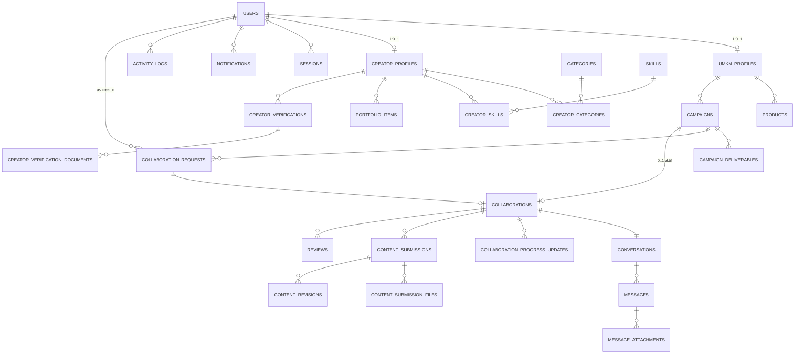

# Technical Design Document (TDD) — Collabite

> **Versi:** 1.0 (Approved)
> **Tanggal:** 2026-06-18
> **Status:** Disetujui sebagai acuan implementasi M0–M7.

---

## 1. Tujuan Teknis

1. Menyediakan rancangan teknis yang konsisten dengan PRD dan Use Case.
2. Menjamin modularitas sehingga tiap modul dapat diuji dan dikembangkan secara terpisah.
3. Menjamin keamanan, observabilitas, dan kemampuan pemulihan data sesuai NFR.
4. Menjadi acuan implementasi untuk engineer (struktur folder, ERD, status enum, state transition).

---

## 2. Architectural Drivers

| Driver | Penjelasan |
| --- | --- |
| **Time-to-market MVP** | MVP harus cepat di-rilis. Pilih stack yang sudah dikenal tim: Laravel monolith, Inertia, React, MySQL. |
| **Konsistensi pengalaman** | SPA-like UX dengan server-side rendering opsional (Inertia SSR opsional) tanpa REST API internal. |
| **Keamanan data sensitif** | Dokumen verifikasi & lampiran pesan disimpan private, diakses via signed URL. |
| **Observability** | Audit log untuk semua event kolaborasi & moderasi. |
| **Biaya operasional rendah** | Queue database (tanpa Redis), mail driver log pada development, file storage lokal pada MVP. |
| **Skalabilitas terbatas MVP** | 1 instance Laravel + 1 MySQL. Optimasi pagination, indexing, dan query ringan. |

---

## 3. Technology Decisions

| Area | Keputusan |
| --- | --- |
| Bahasa backend | PHP 8.4 |
| Framework | Laravel 13 |
| Frontend | React 19 + TypeScript |
| Bridge | Inertia.js v3 |
| Build tool | Vite |
| Database | MySQL 8.x |
| ORM | Eloquent |
| Auth | Laravel session authentication (Fortify v1) |
| Authorization | Laravel Policies |
| Validation | Laravel Form Requests |
| UI components | shadcn/ui + Tailwind CSS v4 |
| File storage | Laravel Filesystem (disk `public` & `private`) |
| Queue | Database queue |
| Notification | Database + Email (Mailpit/log di dev) |
| Backend test | Pest v4 |
| Frontend test | Vitest + React Testing Library |
| E2E test | Playwright |
| Analisa statis | Larastan v3 (level 6) |
| Formatter | Pint v1 |
| Lint frontend | ESLint v9 + Prettier v3 |

Detail keputusan ada di [DECISIONS.md](./DECISIONS.md).

---

## 4. Arsitektur Tingkat Tinggi

- **Laravel monolith**: seluruh domain (Auth, Profile, Campaign, Collaboration, dsb.) berada dalam satu codebase Laravel.
- **Inertia.js**: controller merender `Inertia::render(component, props)`. Tidak ada REST API internal; satu server-side routing, satu front-end SPA.
- **Domain modular di Laravel**: dipisah melalui folder `app/Http/Controllers/{Umkm,Creator,Admin,Public}`, `app/Models`, `app/Policies`, `app/Http/Requests`.
- **Queue database**: email, ekspor laporan, dan notifikasi berat dijalankan via job.
- **File storage**: dua disk — `public` (logo usaha, foto produk, foto portofolio) dan `private` (dokumen verifikasi, lampiran pesan, file submission). Akses publik melalui `Storage::url()`; akses private melalui signed URL sementara.

---

## 5. Request Lifecycle Laravel ↔ Inertia

1. Browser mengirim request HTTP ke URL web (GET/POST/PUT/DELETE).
2. Middleware (`web`, `auth`, `verified`, `role:*`) memproses request.
3. Form Request memvalidasi payload (jika bukan GET).
4. Controller memanggil Service/Action modul yang relevan; Policy dicek sebelum mutasi.
5. Controller memanggil `Inertia::render('Namespace/Page', props)`.
6. Inertia Laravel adapter mengembalikan HTML (first load) atau JSON `X-Inertia` (subsequent) ke client.
7. Inertia Client di React merender komponen halaman dengan props.
8. Untuk form submission, controller mengembalikan `redirect()->back()` atau `Inertia::location()`.

---

## 6. Struktur Folder

```
.
├── app/
│   ├── Actions/                # Action classes (use case logic)
│   ├── Concerns/               # Trait bersama
│   ├── Console/                # Artisan commands
│   ├── Enums/                  # PHP Enums (status)
│   ├── Http/
│   │   ├── Controllers/
│   │   │   ├── Auth/           # Login, register, verifikasi
│   │   │   ├── Public/         # Landing, profil publik
│   │   │   ├── Umkm/           # Controller khusus UMKM
│   │   │   ├── Creator/        # Controller khusus Creator
│   │   │   └── Admin/          # Controller khusus Admin
│   │   ├── Middleware/
│   │   ├── Requests/           # Form Requests per use case
│   │   └── Resources/          # (opsional) untuk serialisasi JSON
│   ├── Models/                 # Eloquent models
│   ├── Notifications/          # Notifikasi in-app & email
│   ├── Policies/               # Otorisasi per resource
│   ├── Providers/              # Service providers
│   └── Services/               # Layanan domain (mis. AuditLogger)
├── bootstrap/
├── config/
├── database/
│   ├── factories/              # Factory per model
│   ├── migrations/
│   └── seeders/                # Seed admin, kategori, skill
├── public/
├── resources/
│   ├── css/
│   ├── js/
│   │   ├── actions/            # Wayfinder-generated controller actions
│   │   ├── components/         # Shared components (UI primitives, layout)
│   │   ├── hooks/              # Custom React hooks
│   │   ├── layouts/            # Layout per role
│   │   ├── lib/                # Utilitas
│   │   ├── pages/              # Halaman Inertia
│   │   │   ├── Auth/
│   │   │   ├── Public/
│   │   │   ├── Umkm/
│   │   │   ├── Creator/
│   │   │   └── Admin/
│   │   ├── routes/             # Wayfinder-generated named routes
│   │   ├── types/              # TypeScript types
│   │   ├── wayfinder/          # Generated helpers
│   │   └── app.tsx
│   └── views/                  # Blade fallback (errors)
├── routes/
│   ├── web.php
│   └── settings.php
├── storage/
├── tests/
│   ├── Feature/
│   ├── Unit/
│   └── E2E/                    # Playwright (di root atau tests/e2e)
├── docs/
├── AGENTS.md
└── README.md
```

---

## 7. Pembagian Module

Module domain dipisahkan berdasarkan tanggung jawab (lihat juga [COMPONENT_DIAGRAM.md](./COMPONENT_DIAGRAM.md)):

1. `Authentication & Account`
2. `Profile & Portfolio`
3. `Creator Verification`
4. `Campaign Management`
5. `Creator Discovery` (read-only query)
6. `Collaboration Management`
7. `Messaging`
8. `Content & Progress`
9. `Rating & Review`
10. `Admin & Moderation`
11. `Notification`
12. `Audit & Activity`
13. `Reporting & Monitoring`

Tiap modul diimplementasikan dengan:
- `app/Http/Controllers/{Role}/{Module}Controller.php`
- `app/Http/Requests/{Module}/*Request.php`
- `app/Models/{Module}.php`
- `app/Policies/{Module}Policy.php`
- `app/Actions/{Module}/*Action.php` (untuk logika non-CRUD)
- `database/factories/{Module}Factory.php`
- `tests/Feature/{Module}/*Test.php`

---

## 8. Authentication

- **Provider:** Laravel session auth + Fortify (atau scaffold Fortify yang sudah ada di project).
- **Flow:** email + password. Session disimpan di `sessions` table.
- **Verifikasi email:** Link bertanda tangan (signed URL) yang dikirim via Mail.
- **Reset password:** Link dengan token 60 menit.
- **Role:** disimpan di `users.role` (enum `umkm`, `creator`, `admin`).
- **Account status:** `users.account_status` (enum `active`, `suspended`).
- **Rate limit:** `throttle:6,1` untuk login; `throttle:3,1` untuk forgot-password.
- **Logout:** invalidate session + regenerate token.

---

## 9. Role & Account Status

- **Role** (Enum `UserRole`):
  - `Umkm`
  - `Creator`
  - `Admin`
- **AccountStatus** (Enum `AccountStatus`):
  - `Active`
  - `Suspended`
- Middleware `role:{role}` memastikan akses halaman sesuai role.
- Login gagal jika `account_status = Suspended` (lihat UC-AUTH-003).

---

## 10. Authorization Policies

Tiap resource utama memiliki Policy:

- `UserPolicy`
- `UmkmProfilePolicy`
- `CreatorProfilePolicy`
- `CampaignPolicy`
- `CollaborationRequestPolicy`
- `CollaborationPolicy`
- `MessagePolicy`
- `ContentSubmissionPolicy`
- `ReviewPolicy`
- `VerificationPolicy`
- `ActivityLogPolicy` (admin only)

Policy dipanggil di controller (`$this->authorize('update', $campaign)`) atau otomatis di `FormRequest->authorize()`.

---

## 11. Validation

- Setiap input dari klien divalidasi via Form Request.
- Validasi lintas field (mis. `deadline > today`, `budget >= 0`).
- Validasi `unique` di-handle di level database (unique constraint) dan di Form Request.
- Validasi file: `mimes:jpg,jpeg,png,webp,mp4`, `max:10240` (10 MB) untuk submission; `max:2048` (2 MB) untuk logo/produk/portofolio gambar.

---

## 12. Error Handling

- Global exception handler memetakan error ke:
  - 401 (belum login) → redirect ke `/login`.
  - 403 (tidak berwenang) → halaman 403 kustom.
  - 404 (tidak ditemukan) → halaman 404 kustom.
  - 422 (validasi) → kembali ke form dengan error bag (via Inertia errors).
  - 500 (server error) → halaman 500 kustom + log.
- Inertia: error ditampilkan via `usePage().props.errors` (default Inertia).

---

## 13. Database Design

### 13.1 ERD (Mermaid)



### 13.2 Rancangan Tabel

> Nama tabel snake_case. Kolom `id`, `timestamps`. Soft delete ditambahkan sesuai catatan.

#### `users`
- **Tujuan:** Akun pengguna.
- **Kolom utama:** `id`, `name`, `email (unique)`, `password`, `role` (enum), `account_status` (enum), `email_verified_at`, `remember_token`.
- **FK:** -
- **Unique:** `email`.
- **Index:** `email`, `role`, `account_status`.
- **Relasi:** `umkmProfile`, `creatorProfile`, `notifications`, `sessions`, `activityLogs`.
- **Data sensitif:** `password` (hash).
- **Soft delete:** Tidak.

#### `umkm_profiles`
- **Tujuan:** Profil usaha UMKM.
- **Kolom utama:** `id`, `user_id (FK)`, `business_name`, `business_type`, `description`, `address`, `logo_path`, `contact_phone`, `contact_email`, `website_url`, `city`.
- **FK:** `user_id → users.id`.
- **Unique:** `user_id`.
- **Index:** `city`, `business_type`.
- **Relasi:** `user`, `products`, `campaigns`.
- **Data sensitif:** `contact_email`, `contact_phone`.
- **Soft delete:** Tidak.

#### `creator_profiles`
- **Tujuan:** Profil Creator.
- **Kolom utama:** `id`, `user_id (FK)`, `bio`, `headline`, `profile_photo_path`, `city`, `contact_phone`, `contact_email`, `verification_status` (enum), `rating_avg` (decimal 3,2), `rating_count` (int).
- **FK:** `user_id → users.id`.
- **Unique:** `user_id`.
- **Index:** `city`, `verification_status`, `rating_avg`.
- **Relasi:** `user`, `categories`, `skills`, `portfolioItems`, `verifications`.
- **Data sensitif:** `contact_email`, `contact_phone`.
- **Soft delete:** Tidak.

#### `products`
- **Tujuan:** Produk/jasa UMKM.
- **Kolom utama:** `id`, `umkm_profile_id (FK)`, `name`, `description`, `image_path`, `price (decimal 12,2 nullable)`, `is_active` (bool).
- **FK:** `umkm_profile_id → umkm_profiles.id`.
- **Index:** `umkm_profile_id`, `is_active`.
- **Relasi:** `umkmProfile`.
- **Data sensitif:** -
- **Soft delete:** Ya.

#### `categories`
- **Tujuan:** Kategori konten.
- **Kolom utama:** `id`, `name (unique)`, `slug (unique)`, `description`.
- **Unique:** `name`, `slug`.
- **Relasi:** `creators` (via `creator_categories`), `campaigns` (via `campaign_categories` — lihat catatan).
- **Catatan:** MVP menghubungkan kategori ke campaign via field `category_id` di `campaigns` (relasi langsung). Tabel pivot `campaign_categories` dapat ditambahkan pasca-MVP jika dibutuhkan multi-kategori.

#### `skills`
- **Tujuan:** Keahlian Creator.
- **Kolom utama:** `id`, `name (unique)`, `slug (unique)`.
- **Unique:** `name`, `slug`.

#### `creator_categories`
- **Tujuan:** Pivot Creator ↔ Category.
- **Kolom:** `id`, `creator_profile_id (FK)`, `category_id (FK)`.
- **Unique:** `(creator_profile_id, category_id)`.

#### `creator_skills`
- **Tujuan:** Pivot Creator ↔ Skill.
- **Kolom:** `id`, `creator_profile_id (FK)`, `skill_id (FK)`.
- **Unique:** `(creator_profile_id, skill_id)`.

#### `portfolio_items`
- **Tujuan:** Item portofolio Creator.
- **Kolom:** `id`, `creator_profile_id (FK)`, `title`, `description`, `media_path`, `external_url (nullable)`, `display_order` (int).
- **FK:** `creator_profile_id → creator_profiles.id`.
- **Index:** `creator_profile_id`, `display_order`.
- **Soft delete:** Ya.

#### `creator_verifications`
- **Tujuan:** Pengajuan verifikasi Creator.
- **Kolom:** `id`, `creator_profile_id (FK)`, `status` (enum: `pending`, `approved`, `rejected`, `revision_requested`), `submitted_at`, `reviewed_at`, `reviewed_by (FK users.id nullable)`, `rejection_reason (text nullable)`.
- **FK:** `creator_profile_id → creator_profiles.id`, `reviewed_by → users.id`.
- **Unique:** tidak ada; boleh beberapa history per Creator, hanya satu `pending`/`approved` aktif.
- **Index:** `status`, `creator_profile_id`.
- **Relasi:** `documents`.
- **Catatan:** Unique constraint parsial dapat ditambahkan untuk memastikan hanya satu `pending` per Creator.
- **Soft delete:** Tidak.

#### `creator_verification_documents`
- **Tujuan:** Dokumen identitas & portofolio.
- **Kolom:** `id`, `creator_verification_id (FK)`, `type` (enum: `identity_card`, `portfolio_proof`, `other`), `file_path`, `original_name`, `mime_type`, `size`.
- **FK:** `creator_verification_id → creator_verifications.id`.
- **Index:** `creator_verification_id`.
- **Data sensitif:** Ya (disimpan di private disk).
- **Soft delete:** Tidak.

#### `campaigns`
- **Tujuan:** Campaign UMKM.
- **Kolom:** `id`, `umkm_profile_id (FK)`, `title`, `description`, `category_id (FK)`, `budget` (decimal 14,2), `deadline` (date), `status` (enum: `draft`, `open`, `in_collaboration`, `completed`, `cancelled`), `is_hidden` (bool, default false), `published_at (nullable)`.
- **FK:** `umkm_profile_id → umkm_profiles.id`, `category_id → categories.id`.
- **Index:** `status`, `category_id`, `umkm_profile_id`, `deadline`, `(status, is_hidden)` (composite).
- **Relasi:** `deliverables`, `requests`, `collaboration`.
- **Soft delete:** Ya.

#### `campaign_deliverables`
- **Tujuan:** Daftar deliverable campaign.
- **Kolom:** `id`, `campaign_id (FK)`, `title`, `description`, `quantity` (int default 1).
- **FK:** `campaign_id → campaigns.id`.
- **Index:** `campaign_id`.

#### `collaboration_requests`
- **Tujuan:** Application & Invitation.
- **Kolom:** `id`, `campaign_id (FK)`, `creator_id (FK users.id)`, `sender_id (FK users.id)`, `type` (enum: `application`, `invitation`), `status` (enum: `pending`, `accepted`, `rejected`, `cancelled_by_creator`, `cancelled_by_umkm`), `message (text nullable)`, `responded_at (nullable)`.
- **FK:** `campaign_id → campaigns.id`, `creator_id → users.id`, `sender_id → users.id`.
- **Unique:** `(creator_id, campaign_id)` untuk kombinasi dengan status `pending` atau `accepted` (parsial index).
- **Index:** `status`, `creator_id`, `campaign_id`.
- **Soft delete:** Tidak (status cukup).

#### `collaborations`
- **Tujuan:** Kolaborasi aktif antara UMKM & Creator.
- **Kolom:** `id`, `campaign_id (FK unique)`, `umkm_id (FK users.id)`, `creator_id (FK users.id)`, `status` (enum: `active`, `completed`, `cancelled`), `started_at`, `completed_at (nullable)`, `cancelled_at (nullable)`, `cancelled_by (FK users.id nullable)`, `cancelled_reason (text nullable)`.
- **FK:** `campaign_id → campaigns.id`, `umkm_id → users.id`, `creator_id → users.id`, `cancelled_by → users.id`.
- **Unique:** `campaign_id` (1 collaboration per campaign).
- **Index:** `creator_id`, `umkm_id`, `status`.
- **Relasi:** `conversation`, `progressUpdates`, `submissions`, `reviews`.
- **Soft delete:** Ya.

#### `collaboration_progress_updates`
- **Tujuan:** Timeline progres Creator.
- **Kolom:** `id`, `collaboration_id (FK)`, `creator_id (FK users.id)`, `message (text)`, `attachment_path (nullable)`, `created_at`.
- **FK:** `collaboration_id → collaborations.id`, `creator_id → users.id`.
- **Index:** `collaboration_id`, `created_at`.

#### `conversations`
- **Tujuan:** Ruang pesan dalam kolaborasi.
- **Kolom:** `id`, `collaboration_id (FK unique)`, `last_message_at (nullable)`.
- **FK:** `collaboration_id → collaborations.id`.
- **Unique:** `collaboration_id`.

#### `messages`
- **Tujuan:** Pesan.
- **Kolom:** `id`, `conversation_id (FK)`, `sender_id (FK users.id)`, `body (text)`, `created_at`, `read_at (nullable)`, `is_hidden (bool default false)`.
- **FK:** `conversation_id → conversations.id`, `sender_id → users.id`.
- **Index:** `conversation_id`, `created_at`, `is_hidden`.
- **Catatan:** Immutable (BR-011). Tidak ada endpoint edit/hapus oleh user. Admin hanya dapat set `is_hidden`.
- **Soft delete:** Ya (hidden flag, bukan delete).

#### `message_attachments`
- **Tujuan:** Lampiran pesan.
- **Kolom:** `id`, `message_id (FK)`, `file_path`, `original_name`, `mime_type`, `size`.
- **FK:** `message_id → messages.id`.
- **Index:** `message_id`.
- **Data sensitif:** Ya (private disk).

#### `content_submissions`
- **Tujuan:** Submission konten.
- **Kolom:** `id`, `collaboration_id (FK)`, `version` (int), `title`, `description`, `status` (enum: `draft`, `in_review`, `revision_requested`, `approved`, `superseded`), `is_hidden` (bool), `submitted_at (nullable)`, `approved_at (nullable)`.
- **FK:** `collaboration_id → collaborations.id`.
- **Unique:** `(collaboration_id, version)`.
- **Index:** `status`, `collaboration_id`, `is_hidden`.
- **Relasi:** `files`, `revisions`.
- **Soft delete:** Ya.

#### `content_submission_files`
- **Tujuan:** File lampiran submission.
- **Kolom:** `id`, `content_submission_id (FK)`, `file_path`, `original_name`, `mime_type`, `size`.
- **FK:** `content_submission_id → content_submissions.id`.
- **Index:** `content_submission_id`.
- **Data sensitif:** Ya (private disk).

#### `content_revisions`
- **Tujuan:** Catatan revisi dari UMKM.
- **Kolom:** `id`, `content_submission_id (FK)`, `umkm_id (FK users.id)`, `note (text)`, `created_at`.
- **FK:** `content_submission_id → content_submissions.id`, `umkm_id → users.id`.
- **Index:** `content_submission_id`.

#### `reviews`
- **Tujuan:** Rating & review dua arah.
- **Kolom:** `id`, `collaboration_id (FK)`, `reviewer_id (FK users.id)`, `reviewee_id (FK users.id)`, `rating` (tinyint 1..5), `body (text nullable)`, `is_hidden` (bool), `created_at`.
- **FK:** `collaboration_id → collaborations.id`, `reviewer_id → users.id`, `reviewee_id → users.id`.
- **Unique:** `(collaboration_id, reviewer_id)`.
- **Index:** `reviewee_id`, `rating`.
- **Soft delete:** Ya.

#### `notifications`
- **Tujuan:** Notifikasi in-app (tabel bawaan Laravel).
- **Kolom:** `id`, `type`, `notifiable_type`, `notifiable_id`, `data (json)`, `read_at (nullable)`, `created_at`.
- **Index:** `notifiable_type, notifiable_id`, `read_at`.

#### `activity_logs`
- **Tujuan:** Audit log platform.
- **Kolom:** `id`, `actor_id (FK users.id nullable)`, `actor_role (string nullable)`, `action` (string), `subject_type`, `subject_id`, `metadata (json nullable)`, `created_at`.
- **FK:** `actor_id → users.id`.
- **Index:** `action`, `subject_type, subject_id`, `created_at`.
- **Catatan:** Append-only (tidak ada update/delete).
- **Soft delete:** Tidak.

---

## 14. Status Enum

### 14.1 `users.account_status`
- `Active`
- `Suspended`

### 14.2 `creator_profiles.verification_status`
- `Unverified`
- `Pending`
- `Verified`
- `Rejected`

### 14.3 `campaigns.status`
- `Draft`
- `Open`
- `InCollaboration`
- `Completed`
- `Cancelled`

### 14.4 `collaboration_requests.status`
- `Pending`
- `Accepted`
- `Rejected`
- `CancelledByCreator`
- `CancelledByUmkm`

### 14.5 `collaborations.status`
- `Active`
- `Completed`
- `Cancelled`

### 14.6 `content_submissions.status`
- `Draft`
- `InReview`
- `RevisionRequested`
- `Approved`
- `Superseded`

---

## 15. State Transition

### 15.1 Campaign

```
Draft  --(publish)-->  Open
Draft  --(cancel)-->   Cancelled
Open   --(collab accepted)--> InCollaboration
Open   --(cancel)-->   Cancelled
InCollaboration --(collab cancelled pre-approval)--> Open
InCollaboration --(collab completed)--> Completed
```

> `Cancel` hanya boleh dilakukan UMKM ketika campaign belum memiliki kolaborasi `accepted`/`active` (BR-005, BR-013).

### 15.2 Collaboration Request

```
Pending --(UMKM accept application)-->   Accepted  --(auto)-->  Collaboration Active
Pending --(Creator accept invitation)--> Accepted  --(auto)-->  Collaboration Active
Pending --(UMKM reject)-->              Rejected
Pending --(Creator reject)-->           Rejected
Pending --(Creator cancel app)-->       CancelledByCreator
Pending --(UMKM cancel invitation)-->   CancelledByUmkm
Accepted --(collab cancelled pre-approval)--> Cancelled (collab row updated)
```

### 15.3 Content Submission

```
Draft --(submit)-->                  InReview
InReview --(request revision)-->     RevisionRequested
InReview --(approve)-->              Approved
RevisionRequested --(submit new)-->  Draft  (new version row)
Approved --(new version created)-->  Superseded
```

### 15.4 Collaboration

```
Active --(UMKM complete)-->               Completed
Active --(UMKM/Creator cancel pre-approval)--> Cancelled (BR-013, wajib alasan)
Active --(Admin force close)-->           Cancelled (UC-ADMIN-010)
Completed --(admin reopen? )-->           Tidak diizinkan pada MVP
```

> Detail transisi dilindungi oleh Policy + Action class untuk mencegah perpindahan invalid (UC-CONT-008).

---

## 16. File Upload (Kebijakan Final)

### 16.1 Ukuran & Format

| Jenis File | Ukuran Maks | Format | Disk |
| --- | --- | --- | --- |
| Avatar / Logo usaha | 2 MB | JPEG, PNG, WebP | public |
| Gambar produk | 2 MB | JPEG, PNG, WebP | public |
| Gambar portofolio | 5 MB | JPEG, PNG, WebP | public |
| Video portofolio | 50 MB | MP4, MOV, WebM | public |
| Dokumen verifikasi Creator | 5 MB | PDF, JPEG, PNG | private |
| Lampiran pesan | 10 MB | JPEG, PNG, WebP, PDF, ZIP | private |
| File content submission | 100 MB / file | MP4, MOV, WebM, JPEG, PNG, PDF | private |

### 16.2 Aturan Tambahan

- **MIME validation** di Form Request sesuai kolom "Format".
- **Extension validation** di Form Request (whitelist).
- **Ownership validation** lewat Policy/Owner check sebelum unduh/serve.
- **Batas jumlah file per request** dideklarasikan per endpoint (default 1 untuk submission, ≤ 5 untuk portofolio, ≤ 5 untuk lampiran pesan).
- **Authorized/private download** lewat signed URL TTL ≤ 30 menit.
- **Nama file acak**: UUIDv4. `original_name`, `mime_type`, `size`, dan `path` disimpan di DB.
- **Path pattern**: `{module}/{owner_id}/{uuid}.{ext}`.
- **Konfigurasi production minimum**:
  - PHP: `upload_max_filesize=110M`, `post_max_size=120M`, `memory_limit=256M`.
  - Nginx: `client_max_body_size=120M`.
  - Apache: `LimitRequestBody=125829120`.
- **Automated test**: tidak boleh upload file sebesar batas maksimum. Gunakan fake upload ≤ 50 KB dan uji batas dengan metadata atau stub ukuran.

---

## 17. Private & Public Storage

- `config/filesystems.php` mendefinisikan disk `public` (symlink ke `public/storage`) dan disk `private` (path di `storage/app/private`).
- Service `FileUrlService` membungkus pembuatan URL:
  - `public($path)` → `Storage::disk('public')->url($path)`.
  - `private($path, $ttl)` → `URL::temporarySignedRoute('files.private', $ttl, ['path' => $path])`.
- Controller `FilesController@show` memvalidasi signed URL dan melakukan streaming file.

---

## 18. Messaging

- Setiap `collaboration` memiliki tepat satu `conversation` (created saat kolaborasi aktif).
- Pengiriman pesan via `POST /collaborations/{id}/messages` → Inertia.
- Status baca: field `read_at` di `messages` per user (tidak ada tabel pivot; implementasi dapat menggunakan tabel `message_reads` jika volume tinggi).
- MVP menggunakan polling (lihat DECISIONS.md). Frontend dapat melakukan polling setiap 15 detik di halaman kolaborasi, dengan Inertia `defer`/`merge`.

---

## 19. Notification

- Notifikasi in-app menggunakan `Notifiable` trait & tabel `notifications`.
- Email menggunakan `Mailable` + `ShouldQueue` → masuk database queue.
- Listener memetakan event domain ke Notification:
  - `CollaborationRequestSent`
  - `CollaborationRequestResponded`
  - `ContentSubmissionSubmitted`
  - `ContentRevisionRequested`
  - `ContentSubmissionApproved`
  - `CollaborationCompleted`
  - `VerificationStatusChanged`

---

## 20. Queue

- `QUEUE_CONNECTION=database` (default MVP).
- Tabel `jobs` (sudah ada di migration `0001_01_01_000002_create_jobs_table.php`).
- Worker: `php artisan queue:work --tries=3 --backoff=60` dijalankan via supervisor (deployment).

---

## 21. Scheduler

- `app/Console/Kernel.php` menjadwalkan:
  - `audit:prune` — hapus log > 1 tahun (default off; toggle via config).
  - `notifications:mark-read` — placeholder; tidak wajib.
  - `reports:daily` — agregasi harian (opsional).
- Scheduler dijalankan via `* * * * * php artisan schedule:run`.

---

## 22. Audit Log

- Service `AuditLogger::log(action, subject, metadata)` dipanggil dari Action/Observer.
- Format subject: polymorphic `subject_type` + `subject_id`.
- Append-only (tidak ada update/delete).
- Admin melihat log di `Admin/AuditLogController@index` dengan filter.

---

## 23. Reporting

- Statistik diambil via query agregat MySQL.
- Ekspor CSV menggunakan `maatwebsite/excel` (tidak dimasukkan dependency tambahan; menggunakan `fputcsv` di MVP).
- Job `GenerateReport` membuat file di storage private dan mengirim link signed URL ke Admin.

---

## 24. Search & Filtering

- Pencarian Creator: filter `categories.id`, `verification_status`, `rating_avg >= min`, `city`, kata kunci pada `name`/`headline`/`bio`.
- Pencarian Campaign: filter `categories.id`, `status='open'`, `budget between`, kata kunci pada `title`/`description`.
- Implementasi: query Eloquent dengan `whereHas`/`whereBetween`; index komposit pada kolom filter.
- Pagination: `paginate(15)` (default MVP, ≤ 20 sesuai NFR-PERFORMANCE-001).

---

## 25. Pagination

- Semua endpoint `index` mengembalikan `LengthAwarePaginator`.
- Frontend menggunakan komponen pagination shadcn/ui.
- Default page size: 15 (Creator, Campaign). 10 (kolaborasi).

---

## 26. Security

- **CSRF:** Inertia otomatis menyertakan token.
- **Rate limit:** `throttle` pada `login`, `register`, `forgot-password`.
- **Signed URL** untuk file private.
- **Hash password** via `bcrypt` (Laravel default).
- **Policy** di setiap resource.
- **Input validation** via Form Request.
- **Sanitasi** HTML pada teks panjang menggunakan `strip_tags` + escaping di Blade/JSX.
- **Audit log** untuk event kritis.
- **Email enumeration prevention:** response reset password selalu 200.
- **Session fixation prevention:** `regenerate()` setelah login.

---

## 27. Performance

- Index komposit pada kolom filter & FK.
- Eager loading relasi untuk halaman detail.
- `defer()` dan `merge()` Inertia untuk payload berat.
- Pagination.
- Asset pipeline Vite + Tailwind purge otomatis.
- Kompresi gambar upload via intervantion/image (tidak dimasukkan dependency tambahan pada MVP; cukup instruksikan upload ukuran wajar).

---

## 28. Logging

- Log channel default `stack` (single + daily).
- Error 500 → log dengan stack trace.
- Event penting (verifikasi approve/reject, suspend) → log info.
- Tidak mencatat data sensitif (password, token).

---

## 29. Testing Strategy

- **Unit (Pest):** Enum, Service, Action classes.
- **Feature (Pest):** Endpoint + flow use case.
- **Authorization (Pest):** Policy dengan user yang berbeda.
- **React component (Vitest + RTL):** Komponen halaman & shared component.
- **E2E (Playwright):** Skenario happy path & critical path.
- **Static analysis:** Larastan level 6.
- **Formatter:** Pint bersih.

Lihat [TEST_PLAN.md](./TEST_PLAN.md) untuk detail test case.

---

## 30. Deployment Overview

- **Target:** Laravel Cloud (lihat CLAUDE.md) atau VPS (Forge/Docker).
- **Stack runtime:** PHP 8.4, MySQL 8.x, Node 20 LTS (build), Composer 2.x.
- **Build steps:** `composer install --no-dev`; `npm ci && npm run build`; `php artisan migrate --force`; `php artisan storage:link`; `php artisan config:cache route:cache view:cache`.
- **Worker:** `php artisan queue:work` (supervisor).
- **Scheduler:** cron `* * * * * php artisan schedule:run`.
- **Health check:** `/up` (Laravel default).

---

## 31. Backup & Recovery

- Backup MySQL harian (mysqldump / Laravel Cloud automatic).
- Backup storage private disinkronkan ke object storage (opsional pasca-MVP).
- Restore diuji sebelum rilis.

---

## 32. Technical Risks

| ID | Risiko | Mitigasi |
| --- | --- | --- |
| R-TECH-001 | Polling messaging membebani server | Batasi page size & frekuensi; tambah throttle di endpoint. |
| R-TECH-002 | Lampiran besar memenuhi storage | Validasi ukuran; kompresi pasca-MVP. |
| R-TECH-003 | Indeks kurang optimal → query lambat | Review query via EXPLAIN sebelum rilis M3. |
| R-TECH-004 | Single instance MySQL tidak high-availability | Catat sebagai limitasi MVP; re-arsitektur pasca-MVP. |
| R-TECH-005 | Larastan/Pint noise pada PR awal | Set baseline; block merge hanya untuk error baru. |

---

## 33. Open Technical Decisions

| ID | Keputusan | Status |
| --- | --- | --- |
| OTD-001 | Apakah `message_reads` perlu tabel terpisah sejak MVP? | Belum diputuskan; default: kolom `read_at` per pesan (sederhana). |
| OTD-002 | Apakah perlu hard delete atau hanya soft delete untuk `messages`? | Default: soft delete. |
| OTD-003 | Apakah `creator_categories` perlu banyak kategori di campaign (multi)? | Default: 1 kategori per campaign; multi pasca-MVP. |
| OTD-004 | Apakah perlu fitur tag pada campaign? | Tidak di MVP. |
| OTD-005 | Penyimpanan object storage (S3) atau lokal di MVP? | Default: lokal (`storage/app`). |

---

## Lampiran: Traceability Singkat (Entity ↔ Modul ↔ Use Case)

| Tabel | Modul | Use Case |
| --- | --- | --- |
| users, sessions, password_reset_tokens | Authentication & Account | UC-AUTH-* |
| umkm_profiles, products | Profile & Portfolio | UC-PROF-001, UC-PROF-002 |
| creator_profiles, categories, skills, creator_categories, creator_skills, portfolio_items | Profile & Portfolio | UC-PROF-003 s/d UC-PROF-006 |
| creator_verifications, creator_verification_documents | Creator Verification | UC-VERIF-001, UC-VERIF-002 |
| campaigns, campaign_deliverables | Campaign Management | UC-CAMP-001 s/d UC-CAMP-008 |
| collaboration_requests | Collaboration Management | UC-COLLAB-001 s/d UC-COLLAB-006 |
| collaborations, conversations, messages, message_attachments | Collaboration + Messaging | UC-COLLAB-007 s/d UC-COLLAB-010, UC-COM-001 s/d UC-COM-004 |
| collaboration_progress_updates, content_submissions, content_submission_files, content_revisions | Content & Progress | UC-CONT-001 s/d UC-CONT-008 |
| reviews | Rating & Review | UC-REV-001 s/d UC-REV-004 |
| activity_logs | Audit & Activity | UC-AUDIT-001, UC-AUDIT-002 |
| notifications | Notification | UC-NOTIF-001 s/d UC-NOTIF-003 |

---

## Catatan Versi

| Versi | Tanggal | Perubahan | Penulis |
| --- | --- | --- | --- |
| 0.1 (Draft) | 2026-06-18 | Initial draft: arsitektur, ERD, rancangan tabel, status enum, state transition. | Product Engineer |
| 1.0 (Approved) | 2026-06-18 | Tutup OQ-001..OQ-011: single-Creator campaign, immutable messages, cancellable collab pre-approval, file size policy, disk separation, signed URL. Tambah kolom `cancelled_*` di collaborations, `messages.is_hidden`, dan validasi lanjutan. | Product Engineer |
