# Use Case Specification — Collabite

> **Versi:** 1.0 (Approved)
> **Tanggal:** 2026-06-18
> **Status:** Disetujui sebagai acuan implementasi M0–M7.

Dokumen ini menjabarkan use case sistem dari sudut pandang tiga aktor: **UMKM**, **Content Creator**, dan **Admin**. Field input表单 tidak dijadikan use case mandiri. Setiap use case terkait dengan satu atau lebih Functional Requirement di [PRD.md](./PRD.md).

---

## Daftar Use Case per Modul

| Modul | Use Case | Aktor |
| --- | --- | --- |
| Authentication | UC-AUTH-001, UC-AUTH-002, UC-AUTH-003, UC-AUTH-004, UC-AUTH-005, UC-AUTH-006, UC-AUTH-007 | UMKM, Creator |
| Profile & Portfolio | UC-PROF-001, UC-PROF-002, UC-PROF-003, UC-PROF-004, UC-PROF-005, UC-PROF-006 | UMKM, Creator |
| Verification | UC-VERIF-001, UC-VERIF-002 | Creator, Admin |
| Campaign | UC-CAMP-001 s/d UC-CAMP-008 | UMKM, Creator |
| Creator Discovery | UC-DISC-001, UC-DISC-002, UC-DISC-003, UC-DISC-004 | UMKM |
| Collaboration | UC-COLLAB-001 s/d UC-COLLAB-010 | UMKM, Creator |
| Messaging | UC-COM-001 s/d UC-COM-005 | UMKM, Creator |
| Content & Progress | UC-CONT-001 s/d UC-CONT-008 | UMKM, Creator |
| Review | UC-REV-001 s/d UC-REV-005 | UMKM, Creator, Admin |
| Administration | UC-ADMIN-001 s/d UC-ADMIN-009 | Admin |
| Notification | UC-NOTIF-001, UC-NOTIF-002, UC-NOTIF-003 | UMKM, Creator |
| Audit | UC-AUDIT-001, UC-AUDIT-002 | Admin |

---

## Diagram Use Case (Mermaid)

```mermaid
flowchart LR
    subgraph Actors
        A1((UMKM))
        A2((Creator))
        A3((Admin))
    end

    subgraph Authentication
        UC1[UC-AUTH-001<br/>Registrasi UMKM]
        UC2[UC-AUTH-002<br/>Registrasi Creator]
        UC3[UC-AUTH-003<br/>Login]
        UC4[UC-AUTH-004<br/>Logout]
        UC5[UC-AUTH-005<br/>Verifikasi Email]
        UC6[UC-AUTH-006<br/>Reset Password]
    end

    subgraph Profile
        UP1[UC-PROF-001<br/>Kelola Profil UMKM]
        UP2[UC-PROF-002<br/>Kelola Produk]
        UP3[UC-PROF-003<br/>Kelola Profil Creator]
        UP4[UC-PROF-004<br/>Kelola Keahlian]
        UP5[UC-PROF-005<br/>Kelola Kategori]
        UP6[UC-PROF-006<br/>Kelola Portofolio]
    end

    subgraph Verification
        UV1[UC-VERIF-001<br/>Ajukan Verifikasi]
        UV2[UC-VERIF-002<br/>Review Verifikasi]
    end

    subgraph Campaign
        UCM1[UC-CAMP-001<br/>Buat Campaign]
        UCM2[UC-CAMP-002<br/>Edit Campaign]
        UCM3[UC-CAMP-003<br/>Batalkan Campaign]
        UCM4[UC-CAMP-004<br/>Publikasikan Campaign]
        UCM5[UC-CAMP-005<br/>Lihat Daftar Campaign]
        UCM6[UC-CAMP-006<br/>Cari Campaign]
        UCM7[UC-CAMP-007<br/>Lihat Detail Campaign]
    end

    subgraph Discovery
        UD1[UC-DISC-001<br/>Cari Creator]
        UD2[UC-DISC-002<br/>Filter Creator]
        UD3[UC-DISC-003<br/>Lihat Profil Creator]
        UD4[UC-DISC-004<br/>Lihat Portofolio]
    end

    subgraph Collaboration
        UCL1[UC-COLLAB-001<br/>Ajukan Kolaborasi]
        UCL2[UC-COLLAB-002<br/>Undang Creator]
        UCL3[UC-COLLAB-003<br/>Cegah Duplikat Request]
        UCL4[UC-COLLAB-004<br/>Terima Pengajuan]
        UCL5[UC-COLLAB-005<br/>Tolak Pengajuan/Undangan]
        UCL6[UC-COLLAB-006<br/>Batalkan Pengajuan]
        UCL7[UC-COLLAB-007<br/>Konfirmasi Kolaborasi]
        UCL8[UC-COLLAB-008<br/>Lihat Status Kolaborasi]
        UCL9[UC-COLLAB-009<br/>Lihat Riwayat Kolaborasi]
    end

    subgraph Messaging
        UCO1[UC-COM-001<br/>Kirim Pesan]
        UCO2[UC-COM-002<br/>Lihat Pesan]
        UCO3[UC-COM-003<br/>Lampirkan File]
        UCO4[UC-COM-004<br/>Tandai Dibaca]
    end

    subgraph Content
        UCT1[UC-CONT-001<br/>Update Progres]
        UCT2[UC-CONT-002<br/>Upload Konten]
        UCT3[UC-CONT-003<br/>Kirim untuk Review]
        UCT4[UC-CONT-004<br/>Minta Revisi]
        UCT5[UC-CONT-005<br/>Setujui Konten]
        UCT6[UC-CONT-006<br/>Kirim Ulang Konten]
        UCT7[UC-CONT-007<br/>Selesaikan Kolaborasi]
        UCT8[UC-CONT-008<br/>Validasi State Transition]
    end

    subgraph Review
        UR1[UC-REV-001<br/>Beri Rating & Review]
        UR2[UC-REV-002<br/>Lihat Review]
        UR3[UC-REV-003<br/>Cegah Duplikat Review]
        UR4[UC-REV-004<br/>Moderasi Review]
    end

    subgraph Admin
        UAD1[UC-ADMIN-001<br/>Kelola Status Akun]
        UAD2[UC-ADMIN-002<br/>Dashboard Statistik]
        UAD3[UC-ADMIN-003<br/>Lihat Data Pengguna]
        UAD4[UC-ADMIN-004<br/>Verifikasi Creator]
        UAD5[UC-ADMIN-005<br/>Moderasi Campaign]
        UAD6[UC-ADMIN-006<br/>Moderasi Konten]
        UAD7[UC-ADMIN-007<br/>Lihat Audit Log]
        UAD8[UC-ADMIN-008<br/>Generate Laporan]
    end

    subgraph Notification
        UN1[UC-NOTIF-001<br/>Notifikasi In-App]
        UN2[UC-NOTIF-002<br/>Email Notifikasi]
        UN3[UC-NOTIF-003<br/>Tandai Dibaca]
    end

    A1 --> UC1
    A2 --> UC2
    A1 --> UC3
    A2 --> UC3
    A1 --> UC4
    A2 --> UC4
    A1 --> UC5
    A2 --> UC5
    A1 --> UC6
    A2 --> UC6

    A1 --> UP1
    A1 --> UP2
    A2 --> UP3
    A2 --> UP4
    A2 --> UP5
    A2 --> UP6

    A2 --> UV1
    A3 --> UV2

    A1 --> UCM1
    A1 --> UCM2
    A1 --> UCM3
    A1 --> UCM4
    A1 --> UCM5
    A2 --> UCM5
    A2 --> UCM6
    A2 --> UCM7

    A1 --> UD1
    A1 --> UD2
    A1 --> UD3
    A1 --> UD4

    A2 --> UCL1
    A1 --> UCL2
    UCL1 --> UCL3
    UCL2 --> UCL3
    A1 --> UCL4
    A2 --> UCL5
    A1 --> UCL5
    A2 --> UCL6
    UCL4 --> UCL7
    UCL5 --> UCL7
    A1 --> UCL8
    A2 --> UCL8
    A1 --> UCL9
    A2 --> UCL9

    A1 --> UCO1
    A2 --> UCO1
    A1 --> UCO2
    A2 --> UCO2
    A1 --> UCO3
    A2 --> UCO3
    A1 --> UCO4
    A2 --> UCO4

    A2 --> UCT1
    A2 --> UCT2
    A2 --> UCT3
    A1 --> UCT4
    A1 --> UCT5
    A2 --> UCT6
    A1 --> UCT7
    A3 --> UCT8

    A1 --> UR1
    A2 --> UR1
    A1 --> UR2
    A2 --> UR2
    UR1 --> UR3
    A3 --> UR4

    A3 --> UAD1
    A3 --> UAD2
    A3 --> UAD3
    A3 --> UAD4
    A3 --> UAD5
    A3 --> UAD6
    A3 --> UAD7
    A3 --> UAD8

    A1 --> UN1
    A2 --> UN1
    A1 --> UN2
    A2 --> UN2
    A1 --> UN3
    A2 --> UN3
```

---

## Format Use Case

Setiap use case mengikuti format:

- **ID**
- **Nama**
- **Aktor**
- **Tujuan**
- **Prasyarat**
- **Trigger**
- **Alur utama**
- **Alur alternatif**
- **Alur kegagalan**
- **Post-condition**
- **Business rules**
- **Requirement terkait**

---

# 1. Authentication

## UC-AUTH-001 — Registrasi UMKM

| Field | Isi |
| --- | --- |
| **ID** | UC-AUTH-001 |
| **Nama** | Registrasi UMKM |
| **Aktor** | UMKM (calon) |
| **Tujuan** | Mendaftarkan akun UMKM dan membuat profil usaha awal. |
| **Prasyarat** | Belum memiliki akun; email belum terdaftar; calon hanya memilih peran UMKM (single-role). |
| **Trigger** | Pengguna membuka halaman `/register` dan memilih peran UMKM. |
| **Alur utama** | 1. Pengguna memilih peran UMKM. 2. Sistem menampilkan form registrasi UMKM (nama, email, password, nama usaha, jenis usaha). 3. Pengguna mengisi dan mengirim form. 4. Sistem memvalidasi input (lihat alur kegagalan). 5. Sistem membuat akun dengan role `umkm`, status `active` (menunggu verifikasi email), dan profil usaha dalam status `draft`. 6. Sistem mengirim email verifikasi. 7. Sistem menampilkan pesan "cek email Anda untuk verifikasi". |
| **Alur alternatif** | - Jika email sudah terdaftar, sistem menampilkan pesan "email sudah digunakan". - Jika jenis usaha tidak valid, sistem menolak. |
| **Alur kegagalan** | - Validasi gagal → tampilkan pesan error per field. - Email tidak terkirim → tandai user `unverified` dan tampilkan tombol "kirim ulang". |
| **Post-condition** | Akun UMKM tercipta; email verifikasi dikirim. |
| **Business rules** | BR-001, BR-002. |
| **Requirement terkait** | FR-AUTH-001, FR-AUTH-007, FR-NOTIF-002. |

## UC-AUTH-002 — Registrasi Creator

| Field | Isi |
| --- | --- |
| **ID** | UC-AUTH-002 |
| **Nama** | Registrasi Content Creator |
| **Aktor** | Creator (calon) |
| **Tujuan** | Mendaftarkan akun Creator dan membuat profil Creator. |
| **Prasyarat** | Belum memiliki akun; email belum terdaftar. |
| **Trigger** | Pengguna membuka halaman `/register` dan memilih peran Creator. |
| **Alur utama** | 1. Pengguna memilih peran Creator. 2. Sistem menampilkan form (nama, email, password, kontak, bio singkat). 3. Pengguna mengirim form. 4. Sistem memvalidasi dan membuat akun `creator` (status `active`, menunggu verifikasi email) dan profil Creator kosong (belum terverifikasi). 5. Sistem mengirim email verifikasi. |
| **Alur alternatif** | - Email sudah digunakan → pesan kesalahan. |
| **Alur kegagalan** | - Validasi gagal. |
| **Post-condition** | Akun Creator tercipta; email verifikasi dikirim; profil Creator siap dilengkapi. |
| **Business rules** | BR-001, BR-002. |
| **Requirement terkait** | FR-AUTH-002, FR-AUTH-007, FR-NOTIF-002. |

## UC-AUTH-003 — Login

| Field | Isi |
| --- | --- |
| **ID** | UC-AUTH-003 |
| **Nama** | Login |
| **Aktor** | UMKM, Creator, Admin |
| **Tujuan** | Mengakses akun masing-masing. |
| **Prasyarat** | Akun terdaftar; akun berstatus `active`. |
| **Trigger** | Pengguna membuka `/login`. |
| **Alur utama** | 1. Pengguna memasukkan email & password. 2. Sistem memverifikasi kredensial. 3. Sistem membuat sesi dan mengarahkan ke dashboard sesuai role. |
| **Alur alternatif** | - Email/password salah → tampilkan pesan umum. - Email belum diverifikasi → tampilkan pesan "verifikasi email dulu". - Akun suspended → tampilkan pesan "akun dinonaktifkan". |
| **Alur kegagalan** | - Rate limit tercapai → tampilkan pesan tunggu. |
| **Post-condition** | Sesi aktif; audit log login tercatat. |
| **Business rules** | BR-010. |
| **Requirement terkait** | FR-AUTH-003, FR-AUTH-005, FR-AUTH-008, NFR-SECURITY-006. |

## UC-AUTH-004 — Logout

| Field | Isi |
| --- | --- |
| **ID** | UC-AUTH-004 |
| **Nama** | Logout |
| **Aktor** | UMKM, Creator, Admin |
| **Tujuan** | Mengakhiri sesi aktif. |
| **Prasyarat** | Pengguna login. |
| **Trigger** | Pengguna menekan tombol Logout. |
| **Alur utama** | 1. Sistem memvalidasi token CSRF. 2. Sistem menghapus sesi. 3. Sistem mengarahkan ke halaman publik. |
| **Alur alternatif** | - Tidak ada. |
| **Alur kegagalan** | - Sesi tidak valid → tampilkan pesan dan tetap logout. |
| **Post-condition** | Sesi tidak aktif lagi. |
| **Business rules** | - |
| **Requirement terkait** | FR-AUTH-004, NFR-SECURITY-005. |

## UC-AUTH-005 — Verifikasi Email

| Field | Isi |
| --- | --- |
| **ID** | UC-AUTH-005 |
| **Nama** | Verifikasi Email |
| **Aktor** | UMKM, Creator |
| **Tujuan** | Mengaktifkan akses penuh fitur. |
| **Prasyarat** | Email belum diverifikasi. |
| **Trigger** | Pengguna mengklik tautan pada email verifikasi. |
| **Alur utama** | 1. Sistem memvalidasi tanda tangan tautan. 2. Sistem menandai `email_verified_at`. 3. Sistem menampilkan halaman "email terverifikasi" dan tautan ke dashboard. |
| **Alur alternatif** | - Tautan kedaluwarsa → tampilkan form "kirim ulang". |
| **Alur kegagalan** | - Tautan tidak valid → tampilkan pesan. |
| **Post-condition** | Email terverifikasi; pengguna dapat menggunakan fitur sesuai role. |
| **Business rules** | - |
| **Requirement terkait** | FR-AUTH-005, FR-NOTIF-002. |

## UC-AUTH-006 — Reset Password

| Field | Isi |
| --- | --- |
| **ID** | UC-AUTH-006 |
| **Nama** | Reset Password |
| **Aktor** | UMKM, Creator, Admin |
| **Tujuan** | Memulihkan akses akun yang lupa password. |
| **Prasyarat** | Email terdaftar. |
| **Trigger** | Pengguna membuka `/forgot-password`. |
| **Alur utama** | 1. Pengguna memasukkan email. 2. Sistem mengirim tautan reset (selalu respon 200, tanpa membocorkan email ada/tidak). 3. Pengguna mengklik tautan, memasukkan password baru. 4. Sistem menyimpan password baru ter-hash. |
| **Alur alternatif** | - Tautan kedaluwarsa (60 menit). |
| **Alur kegagalan** | - Tautan tidak valid. |
| **Post-condition** | Password baru tersimpan; sesi lain dicabut. |
| **Business rules** | - |
| **Requirement terkait** | FR-AUTH-006, NFR-SECURITY-001, NFR-SECURITY-006. |

## UC-AUTH-007 — Penetapan Role

| Field | Isi |
| --- | --- |
| **ID** | UC-AUTH-007 |
| **Nama** | Penetapan Role Akun |
| **Aktor** | Sistem (saat registrasi) |
| **Tujuan** | Memastikan akun memiliki satu role aktif. |
| **Prasyarat** | Akun baru. |
| **Trigger** | Sistem menerima permintaan registrasi. |
| **Alur utama** | 1. Sistem menetapkan role sesuai jenis registrasi (`umkm` atau `creator`). 2. Admin user diciptakan lewat CLI/Seeder dengan role `admin`. |
| **Alur alternatif** | - |
| **Alur kegagalan** | - |
| **Post-condition** | Akun memiliki satu role tetap. |
| **Business rules** | BR-001. |
| **Requirement terkait** | FR-AUTH-007. |

---

# 2. Profile & Portfolio

## UC-PROF-001 — Kelola Profil UMKM

| Field | Isi |
| --- | --- |
| **ID** | UC-PROF-001 |
| **Nama** | Kelola Profil UMKM |
| **Aktor** | UMKM |
| **Tujuan** | Memperbarui informasi usaha agar Creator memahami bisnis. |
| **Prasyarat** | Login sebagai UMKM; email terverifikasi. |
| **Trigger** | UMKM membuka halaman profil usaha. |
| **Alur utama** | 1. UMKM melihat/mengubah data usaha (nama usaha, deskripsi, alamat, logo, kontak). 2. Sistem menyimpan perubahan. 3. Profil tampil di halaman publik UMKM. |
| **Alur alternatif** | - Logo wajib format gambar, maks 2MB. |
| **Alur kegagalan** | - Validasi gagal. |
| **Post-condition** | Profil usaha terbaru tersimpan. |
| **Business rules** | - |
| **Requirement terkait** | FR-PROFILE-001. |

## UC-PROF-002 — Kelola Produk/Jasa

| Field | Isi |
| --- | --- |
| **ID** | UC-PROF-002 |
| **Nama** | Kelola Produk atau Jasa |
| **Aktor** | UMKM |
| **Tujuan** | Memperbarui daftar produk/jasa usaha. |
| **Prasyarat** | Login UMKM; profil usaha ada. |
| **Trigger** | UMKM membuka halaman produk. |
| **Alur utama** | 1. UMKM menambah/mengedit/menghapus produk. 2. Sistem memvalidasi input. 3. Produk tersimpan dan tampil di halaman publik. |
| **Alur alternatif** | - Foto produk maks 2MB. |
| **Alur kegagalan** | - Validasi gagal. |
| **Post-condition** | Daftar produk terbaru. |
| **Business rules** | - |
| **Requirement terkait** | FR-PROFILE-002. |

## UC-PROF-003 — Kelola Profil Creator

| Field | Isi |
| --- | --- |
| **ID** | UC-PROF-003 |
| **Nama** | Kelola Profil Creator |
| **Aktor** | Creator |
| **Tujuan** | Memperbarui data diri Creator. |
| **Prasyarat** | Login Creator; email terverifikasi. |
| **Trigger** | Creator membuka halaman profil. |
| **Alur utama** | 1. Creator mengubah bio, foto, kota, kontak publik. 2. Sistem menyimpan. |
| **Alur alternatif** | - |
| **Alur kegagalan** | - |
| **Post-condition** | Profil Creator terbaru tampil publik. |
| **Business rules** | - |
| **Requirement terkait** | FR-PROFILE-003. |

## UC-PROF-004 — Kelola Keahlian

| Field | Isi |
| --- | --- |
| **ID** | UC-PROF-004 |
| **Nama** | Kelola Keahlian Creator |
| **Aktor** | Creator |
| **Tujuan** | Mencantumkan keahlian yang dikuasai. |
| **Prasyarat** | Login Creator. |
| **Trigger** | Creator membuka tab "Keahlian". |
| **Alur utama** | 1. Creator menambah/menghapus keahlian dari katalog. 2. Sistem menyimpan relasi `creator_skills`. |
| **Alur alternatif** | - |
| **Alur kegagalan** | - |
| **Post-condition** | Daftar keahlian tersimpan. |
| **Business rules** | - |
| **Requirement terkait** | FR-PROFILE-004. |

## UC-PROF-005 — Kelola Kategori

| Field | Isi |
| --- | --- |
| **ID** | UC-PROF-005 |
| **Nama** | Kelola Kategori Konten |
| **Aktor** | Creator |
| **Tujuan** | Memilih kategori konten yang dikuasai. |
| **Prasyarat** | Login Creator. |
| **Trigger** | Creator membuka tab "Kategori". |
| **Alur utama** | 1. Creator memilih satu atau lebih kategori dari katalog. 2. Sistem menyimpan relasi `creator_categories`. |
| **Alur alternatif** | - |
| **Alur kegagalan** | - |
| **Post-condition** | Kategori tersimpan. |
| **Business rules** | - |
| **Requirement terkait** | FR-PROFILE-005. |

## UC-PROF-006 — Kelola Portofolio

| Field | Isi |
| --- | --- |
| **ID** | UC-PROF-006 |
| **Nama** | Kelola Portofolio |
| **Aktor** | Creator |
| **Tujuan** | Menampilkan karya Creator. |
| **Prasyarat** | Login Creator. |
| **Trigger** | Creator membuka halaman portofolio. |
| **Alur utama** | 1. Creator menambah item portofolio: judul, deskripsi, file/tautan media. 2. Sistem memvalidasi dan menyimpan. 3. Item tampil di profil publik. |
| **Alur alternatif** | - Creator dapat menghapus item (soft delete). |
| **Alur kegagalan** | - Ukuran file terlalu besar. |
| **Post-condition** | Portofolio terbaru tampil. |
| **Business rules** | - |
| **Requirement terkait** | FR-PROFILE-006. |

---

# 3. Verification

## UC-VERIF-001 — Ajukan Verifikasi Creator

| Field | Isi |
| --- | --- |
| **ID** | UC-VERIF-001 |
| **Nama** | Ajukan Verifikasi Creator |
| **Aktor** | Creator |
| **Tujuan** | Mendapatkan status Creator terverifikasi. |
| **Prasyarat** | Login Creator; profil terisi minimal; portofolio minimal 1 item. |
| **Trigger** | Creator membuka halaman "Ajukan Verifikasi". |
| **Alur utama** | 1. Creator mengunggah dokumen identitas dan bukti portofolio. 2. Sistem membuat `creator_verification` berstatus `pending`. 3. Admin menerima antrian verifikasi. |
| **Alur alternatif** | - Creator yang sudah `pending`/`approved` tidak dapat mengajukan ulang. |
| **Alur kegagalan** | - Ukuran file tidak valid. |
| **Post-condition** | Pengajuan masuk antrian admin. |
| **Business rules** | BR-003. |
| **Requirement terkait** | FR-PROFILE-007. |

## UC-VERIF-002 — Review Verifikasi (Admin)

| Field | Isi |
| --- | --- |
| **ID** | UC-VERIF-002 |
| **Nama** | Review Verifikasi Creator |
| **Aktor** | Admin |
| **Tujuan** | Menyetujui atau menolak pengajuan verifikasi. |
| **Prasyarat** | Login Admin; ada pengajuan `pending`. |
| **Trigger** | Admin membuka antrian verifikasi. |
| **Alur utama** | 1. Admin membuka detail pengajuan, melihat dokumen. 2. Admin memilih `approve` atau `reject` (dengan alasan). 3. Sistem memperbarui status verifikasi; jika approve, `creator_profiles.verification_status` = `verified`. 4. Sistem mengirim notifikasi ke Creator. |
| **Alur alternatif** | - Admin dapat meminta revisi (status `revision_requested`) dengan catatan. |
| **Alur kegagalan** | - Dokumen tidak dapat diakses (rusak/hilang). |
| **Post-condition** | Status verifikasi Creator berubah. |
| **Business rules** | BR-003. |
| **Requirement terkait** | FR-PROFILE-008, FR-NOTIF-001. |

---

# 4. Campaign

## UC-CAMP-001 — Buat Campaign

| Field | Isi |
| --- | --- |
| **ID** | UC-CAMP-001 |
| **Nama** | Buat Campaign |
| **Aktor** | UMKM |
| **Tujuan** | Mendokumentasikan kebutuhan promosi. |
| **Prasyarat** | Login UMKM; email terverifikasi. |
| **Trigger** | UMKM membuka halaman "Buat Campaign". |
| **Alur utama** | 1. UMKM mengisi judul, deskripsi, kategori, budget, deadline, daftar deliverable. 2. Sistem memvalidasi (budget ≥ 0; deadline > hari ini). 3. Sistem membuat campaign `draft`. |
| **Alur alternatif** | - UMKM dapat menyimpan sebagai draft. |
| **Alur kegagalan** | - Validasi gagal. |
| **Post-condition** | Campaign `draft` tersimpan. |
| **Business rules** | BR-004. |
| **Requirement terkait** | FR-CAMPAIGN-001. |

## UC-CAMP-002 — Edit Campaign

| Field | Isi |
| --- | --- |
| **ID** | UC-CAMP-002 |
| **Nama** | Edit Campaign |
| **Aktor** | UMKM |
| **Tujuan** | Memperbarui data campaign. |
| **Prasyarat** | Campaign milik UMKM; status `draft` atau `open`. |
| **Trigger** | UMKM membuka halaman edit. |
| **Alur utama** | 1. UMKM mengubah field. 2. Sistem memvalidasi. 3. Sistem menyimpan. |
| **Alur alternatif** | - Jika status `cancelled`/`completed` → tampilkan pesan read-only. |
| **Alur kegagalan** | - Validasi gagal. |
| **Post-condition** | Campaign terbaru tersimpan. |
| **Business rules** | BR-004. |
| **Requirement terkait** | FR-CAMPAIGN-002. |

## UC-CAMP-003 — Batalkan Campaign

| Field | Isi |
| --- | --- |
| **ID** | UC-CAMP-003 |
| **Nama** | Batalkan Campaign |
| **Aktor** | UMKM |
| **Tujuan** | Menghentikan campaign. |
| **Prasyarat** | Campaign milik UMKM; status `draft` atau `open`; tidak ada kolaborasi aktif. |
| **Trigger** | UMKM menekan tombol "Batalkan". |
| **Alur utama** | 1. UMKM mengonfirmasi pembatalan. 2. Sistem mengubah status ke `cancelled`. 3. Sistem membatalkan semua request yang masih `pending` dengan pesan. |
| **Alur alternatif** | - |
| **Alur kegagalan** | - Sudah ada kolaborasi aktif → tolak dengan pesan. |
| **Post-condition** | Campaign `cancelled`. |
| **Business rules** | BR-004, BR-005. |
| **Requirement terkait** | FR-CAMPAIGN-003. |

## UC-CAMP-004 — Publikasikan Campaign

| Field | Isi |
| --- | --- |
| **ID** | UC-CAMP-004 |
| **Nama** | Publikasikan Campaign |
| **Aktor** | UMKM |
| **Tujuan** | Membuat campaign terbuka untuk Creator. |
| **Prasyarat** | Campaign berstatus `draft`; data lengkap. |
| **Trigger** | UMKM menekan "Publikasikan". |
| **Alur utama** | 1. Sistem memvalidasi kelengkapan. 2. Status berubah ke `open`. 3. Campaign tampil di pencarian Creator. |
| **Alur alternatif** | - |
| **Alur kegagalan** | - Data belum lengkap → tampilkan field yang kurang. |
| **Post-condition** | Campaign `open`. |
| **Business rules** | BR-004. |
| **Requirement terkait** | FR-CAMPAIGN-004. |

## UC-CAMP-005 — Lihat Daftar Campaign (UMKM)

| Field | Isi |
| --- | --- |
| **ID** | UC-CAMP-005 |
| **Nama** | Lihat Daftar Campaign Milik Sendiri |
| **Aktor** | UMKM |
| **Tujuan** | Memantau seluruh campaign. |
| **Prasyarat** | Login UMKM. |
| **Trigger** | UMKM membuka dashboard campaign. |
| **Alur utama** | 1. Sistem menampilkan daftar campaign UMKM dengan status, jumlah pendaftar, dan kolaborasi aktif. 2. UMKM dapat memfilter berdasarkan status. |
| **Alur alternatif** | - |
| **Alur kegagalan** | - |
| **Post-condition** | Tampilan daftar campaign. |
| **Business rules** | - |
| **Requirement terkait** | FR-CAMPAIGN-005. |

## UC-CAMP-006 — Cari Campaign (Creator)

| Field | Isi |
| --- | --- |
| **ID** | UC-CAMP-006 |
| **Nama** | Cari Campaign |
| **Aktor** | Creator |
| **Tujuan** | Menemukan campaign yang sesuai. |
| **Prasyarat** | Login Creator. |
| **Trigger** | Creator membuka halaman discovery campaign. |
| **Alur utama** | 1. Creator memasukkan kata kunci, filter kategori, range budget. 2. Sistem menampilkan daftar campaign `open` yang cocok dengan paginasi. |
| **Alur alternatif** | - Tidak ada hasil → tampilkan empty state. |
| **Alur kegagalan** | - |
| **Post-condition** | Daftar campaign tampil. |
| **Business rules** | - |
| **Requirement terkait** | FR-CAMPAIGN-006. |

## UC-CAMP-007 — Lihat Detail Campaign

| Field | Isi |
| --- | --- |
| **ID** | UC-CAMP-007 |
| **Nama** | Lihat Detail Campaign |
| **Aktor** | Creator, UMKM |
| **Tujuan** | Melihat informasi lengkap campaign. |
| **Prasyarat** | Login. |
| **Trigger** | Membuka halaman detail. |
| **Alur utama** | 1. Sistem menampilkan judul, deskripsi, kategori, budget, deadline, deliverable, UMKM (nama usaha, rating), dan tombol ajukan kolaborasi (untuk Creator). |
| **Alur alternatif** | - |
| **Alur kegagalan** | - |
| **Post-condition** | Tampilan detail. |
| **Business rules** | - |
| **Requirement terkait** | FR-CAMPAIGN-007. |

## UC-CAMP-008 — Visibility Campaign

| Field | Isi |
| --- | --- |
| **ID** | UC-CAMP-008 |
| **Nama** | Aturan Visibility Campaign |
| **Aktor** | Sistem |
| **Tujuan** | Menentukan campaign mana yang tampil di pencarian. |
| **Prasyarat** | - |
| **Trigger** | Creator melakukan pencarian. |
| **Alur utama** | 1. Sistem hanya menampilkan campaign `open`. 2. Campaign `draft`, `cancelled`, atau `completed` tidak tampil. |
| **Alur alternatif** | - |
| **Alur kegagalan** | - |
| **Post-condition** | - |
| **Business rules** | BR-004. |
| **Requirement terkait** | FR-CAMPAIGN-008. |

---

# 5. Creator Discovery

## UC-DISC-001 — Cari Creator

| Field | Isi |
| --- | --- |
| **ID** | UC-DISC-001 |
| **Nama** | Cari Creator |
| **Aktor** | UMKM |
| **Tujuan** | Menemukan Creator yang relevan. |
| **Prasyarat** | Login UMKM. |
| **Trigger** | UMKM membuka halaman discovery Creator. |
| **Alur utama** | 1. UMKM memasukkan kata kunci (nama, keahlian). 2. Sistem menampilkan daftar Creator dengan paginasi. |
| **Alur alternatif** | - |
| **Alur kegagalan** | - |
| **Post-condition** | Daftar Creator tampil. |
| **Business rules** | - |
| **Requirement terkait** | FR-DISCOVERY-001. |

## UC-DISC-002 — Filter Creator

| Field | Isi |
| --- | --- |
| **ID** | UC-DISC-002 |
| **Nama** | Filter Creator |
| **Aktor** | UMKM |
| **Tujuan** | Menyaring Creator berdasarkan kriteria. |
| **Prasyarat** | Login UMKM. |
| **Trigger** | UMKM mengatur filter. |
| **Alur utama** | 1. UMKM memilih kategori, range rating, status verifikasi. 2. Sistem menerapkan filter dan memperbarui daftar. |
| **Alur alternatif** | - |
| **Alur kegagalan** | - |
| **Post-condition** | Daftar Creator terfilter tampil. |
| **Business rules** | - |
| **Requirement terkait** | FR-DISCOVERY-002. |

## UC-DISC-003 — Lihat Profil Publik Creator

| Field | Isi |
| --- | --- |
| **ID** | UC-DISC-003 |
| **Nama** | Lihat Profil Publik Creator |
| **Aktor** | UMKM |
| **Tujuan** | Mengevaluasi Creator. |
| **Prasyarat** | Login UMKM. |
| **Trigger** | UMKM membuka profil Creator. |
| **Alur utama** | 1. Sistem menampilkan bio, kategori, keahlian, rating, dan label verifikasi. 2. Tombol "Undang" tersedia. |
| **Alur alternatif** | - |
| **Alur kegagalan** | - |
| **Post-condition** | Tampilan profil. |
| **Business rules** | - |
| **Requirement terkait** | FR-DISCOVERY-003, FR-DISCOVERY-004. |

## UC-DISC-004 — Lihat Portofolio Creator

| Field | Isi |
| --- | --- |
| **ID** | UC-DISC-004 |
| **Nama** | Lihat Portofolio Creator |
| **Aktor** | UMKM, publik |
| **Tujuan** | Menilai karya Creator. |
| **Prasyarat** | - |
| **Trigger** | Membuka halaman portofolio Creator. |
| **Alur utama** | 1. Sistem menampilkan daftar item portofolio. |
| **Alur alternatif** | - |
| **Alur kegagalan** | - |
| **Post-condition** | - |
| **Business rules** | - |
| **Requirement terkait** | FR-DISCOVERY-003. |

---

# 6. Collaboration

## UC-COLLAB-001 — Ajukan Kolaborasi (Creator)

| Field | Isi |
| --- | --- |
| **ID** | UC-COLLAB-001 |
| **Nama** | Ajukan Kolaborasi |
| **Aktor** | Creator |
| **Tujuan** | Mengirim lamaran ke campaign. |
| **Prasyarat** | Login Creator; campaign `open`; Creator belum mengajukan. |
| **Trigger** | Creator menekan "Ajukan Kolaborasi" di detail campaign. |
| **Alur utama** | 1. Creator menambahkan pesan singkat & link portofolio (opsional). 2. Sistem membuat `collaboration_request` dengan tipe `application`, status `pending`. 3. UMKM menerima notifikasi. |
| **Alur alternatif** | - |
| **Alur kegagalan** | - Duplikat request → ditolak (lihat UC-COLLAB-003). |
| **Post-condition** | Request `pending`. |
| **Business rules** | BR-004, BR-005. |
| **Requirement terkait** | FR-COLLAB-001, FR-NOTIF-001. |

## UC-COLLAB-002 — Undang Creator (UMKM)

| Field | Isi |
| --- | --- |
| **ID** | UC-COLLAB-002 |
| **Nama** | Undang Creator |
| **Aktor** | UMKM |
| **Tujuan** | Mengirim undangan kolaborasi. |
| **Prasyarat** | Login UMKM; campaign `open`; Creator belum diundang. |
| **Trigger** | UMKM menekan "Undang" pada profil Creator. |
| **Alur utama** | 1. UMKM menambahkan pesan singkat. 2. Sistem membuat `collaboration_request` tipe `invitation`, status `pending`. 3. Creator menerima notifikasi. |
| **Alur alternatif** | - |
| **Alur kegagalan** | - Duplikat invitation ditolak. |
| **Post-condition** | Invitation `pending`. |
| **Business rules** | BR-004, BR-005. |
| **Requirement terkait** | FR-COLLAB-002, FR-NOTIF-001. |

## UC-COLLAB-003 — Cegah Duplikat Request

| Field | Isi |
| --- | --- |
| **ID** | UC-COLLAB-003 |
| **Nama** | Pencegahan Duplikat Request |
| **Aktor** | Sistem |
| **Tujuan** | Menghindari lebih dari satu request aktif untuk kombinasi Creator + Campaign. |
| **Prasyarat** | Ada request `pending` atau `accepted` untuk kombinasi yang sama. |
| **Trigger** | Percobaan membuat request baru. |
| **Alur utama** | 1. Sistem mengecek kombinasi `creator_id` + `campaign_id` dengan status `pending` atau `accepted`. 2. Jika ditemukan, sistem menolak dengan pesan "Anda sudah memiliki pengajuan/undangan untuk campaign ini". |
| **Alur alternatif** | - |
| **Alur kegagalan** | - |
| **Post-condition** | Request duplikat tidak tercipta. |
| **Business rules** | BR-005. |
| **Requirement terkait** | FR-COLLAB-003. |

## UC-COLLAB-004 — Terima Pengajuan/Undangan

| Field | Isi |
| --- | --- |
| **ID** | UC-COLLAB-004 |
| **Nama** | Terima Pengajuan atau Undangan |
| **Aktor** | UMKM, Creator |
| **Tujuan** | Membentuk kolaborasi aktif. |
| **Prasyarat** | Request `pending`. |
| **Trigger** | Penerima request menekan "Terima". |
| **Alur utama** | 1. Sistem memvalidasi bahwa kombinasi belum memiliki kolaborasi aktif. 2. Sistem membentuk `collaboration` berstatus `active`. 3. Sistem mengubah request menjadi `accepted`. 4. Request lain untuk campaign yang sama otomatis menjadi `rejected` (auto-reject). 5. Sistem mengirim notifikasi ke pengirim request. |
| **Alur alternatif** | - |
| **Alur kegagalan** | - Sudah ada kolaborasi aktif → tolak. |
| **Post-condition** | Kolaborasi aktif tercipta. |
| **Business rules** | BR-005. |
| **Requirement terkait** | FR-COLLAB-004, FR-COLLAB-005, FR-COLLAB-007. |

## UC-COLLAB-005 — Tolak Pengajuan/Undangan

| Field | Isi |
| --- | --- |
| **ID** | UC-COLLAB-005 |
| **Nama** | Tolak Pengajuan atau Undangan |
| **Aktor** | UMKM, Creator |
| **Tujuan** | Menutup request tanpa kolaborasi. |
| **Prasyarat** | Request `pending`. |
| **Trigger** | Penerima request menekan "Tolak" (opsional alasan). |
| **Alur utama** | 1. Sistem mengubah status request ke `rejected`. 2. Sistem mengirim notifikasi ke pengirim. |
| **Alur alternatif** | - |
| **Alur kegagalan** | - |
| **Post-condition** | Request `rejected`. |
| **Business rules** | - |
| **Requirement terkait** | FR-COLLAB-005, FR-NOTIF-001. |

## UC-COLLAB-006 — Batalkan Pengajuan

| Field | Isi |
| --- | --- |
| **ID** | UC-COLLAB-006 |
| **Nama** | Batalkan Pengajuan oleh Creator |
| **Aktor** | Creator |
| **Tujuan** | Menarik kembali pengajuan. |
| **Prasyarat** | Request `pending`, milik Creator, tipe `application`. |
| **Trigger** | Creator menekan "Batalkan". |
| **Alur utama** | 1. Sistem mengubah status request ke `cancelled_by_creator`. 2. UMKM menerima notifikasi. |
| **Alur alternatif** | - |
| **Alur kegagalan** | - |
| **Post-condition** | Request `cancelled_by_creator`. |
| **Business rules** | - |
| **Requirement terkait** | FR-COLLAB-006. |

## UC-COLLAB-007 — Pembentukan Kolaborasi

| Field | Isi |
| --- | --- |
| **ID** | UC-COLLAB-007 |
| **Nama** | Pembentukan Kolaborasi |
| **Aktor** | Sistem |
| **Tujuan** | Menghubungkan UMKM dan Creator dalam satu record kolaborasi. |
| **Prasyarat** | Request `accepted`. |
| **Trigger** | Sistem menerima aksi terima. |
| **Alur utama** | 1. Sistem membuat `collaboration` dengan field: campaign_id, umkm_id (dari campaign), creator_id, status `active`, started_at. 2. Sistem mengaitkan `conversation` kosong. |
| **Alur alternatif** | - |
| **Alur kegagalan** | - |
| **Post-condition** | Kolaborasi aktif ada. |
| **Business rules** | BR-005. |
| **Requirement terkait** | FR-COLLAB-007. |

## UC-COLLAB-008 — Lihat Status Kolaborasi

| Field | Isi |
| --- | --- |
| **ID** | UC-COLLAB-008 |
| **Nama** | Lihat Status Kolaborasi |
| **Aktor** | UMKM, Creator |
| **Tujuan** | Memantau kolaborasi aktif. |
| **Prasyarat** | Login sebagai pihak kolaborasi. |
| **Trigger** | Membuka halaman detail kolaborasi. |
| **Alur utama** | 1. Sistem menampilkan status, progres, submission, pesan, dan review. |
| **Alur alternatif** | - |
| **Alur kegagalan** | - Bukan pihak → 403. |
| **Post-condition** | - |
| **Business rules** | - |
| **Requirement terkait** | FR-COLLAB-008, FR-COLLAB-010. |

## UC-COLLAB-009 — Lihat Riwayat Kolaborasi

| Field | Isi |
| --- | --- |
| **ID** | UC-COLLAB-009 |
| **Nama** | Lihat Riwayat Kolaborasi |
| **Aktor** | UMKM, Creator |
| **Tujuan** | Mengakses kolaborasi lampau. |
| **Prasyarat** | Login. |
| **Trigger** | Membuka halaman riwayat. |
| **Alur utama** | 1. Sistem menampilkan daftar kolaborasi yang melibatkan pengguna, diurutkan berdasarkan waktu. |
| **Alur alternatif** | - |
| **Alur kegagalan** | - |
| **Post-condition** | - |
| **Business rules** | - |
| **Requirement terkait** | FR-COLLAB-009. |

## UC-COLLAB-010 — Otorisasi Kolaborasi

| Field | Isi |
| --- | --- |
| **ID** | UC-COLLAB-010 |
| **Nama** | Otorisasi Akses Kolaborasi |
| **Aktor** | Sistem |
| **Tujuan** | Memastikan hanya UMKM/Creator pada kolaborasi yang dapat mengakses. |
| **Prasyarat** | Request akses ke endpoint kolaborasi. |
| **Trigger** | Setiap request ke resource kolaborasi. |
| **Alur utama** | 1. Policy `CollaborationPolicy` mengembalikan allow jika user adalah UMKM atau Creator pada kolaborasi. |
| **Alur alternatif** | - |
| **Alur kegagalan** | - Tolak dengan 403. |
| **Post-condition** | - |
| **Business rules** | - |
| **Requirement terkait** | FR-COLLAB-010, NFR-SECURITY-003. |

## UC-COLLAB-011 — Pembatalan Kolaborasi oleh Pihak

| Field | Isi |
| --- | --- |
| **ID** | UC-COLLAB-011 |
| **Nama** | Pembatalan Kolaborasi oleh UMKM atau Creator |
| **Aktor** | UMKM, Creator |
| **Tujuan** | Menutup kolaborasi yang tidak lagi dilanjutkan. |
| **Prasyarat** | Kolaborasi `active`; submission belum `approved`; user adalah pihak kolaborasi. |
| **Trigger** | User membuka detail kolaborasi dan menekan "Batalkan" dengan alasan. |
| **Alur utama** | 1. Sistem memvalidasi alasan (wajib, ≥ 10 karakter). 2. Status kolaborasi menjadi `cancelled` dengan `cancelled_by`, `cancelled_reason`, `cancelled_at`. 3. Status campaign kembali ke `open` (request pending sebelumnya tidak dipulihkan). 4. Sistem mengirim notifikasi ke pihak lain. 5. Audit log mencatat `collaboration.cancelled`. |
| **Alur alternatif** | - Admin force-close (UC-ADMIN-010) untuk kolaborasi yang submission-nya sudah `approved`. |
| **Alur kegagalan** | - Submission `approved` → tolak untuk pihak, izinkan untuk Admin. - Alasan kosong → tolak. |
| **Post-condition** | Kolaborasi `cancelled`; pesan & submission read-only. |
| **Business rules** | BR-005, BR-009, BR-013. |
| **Requirement terkait** | FR-COLLAB-011, FR-AUDIT-001. |

---

# 7. Communication & Content

## UC-COM-001 — Kirim Pesan

| Field | Isi |
| --- | --- |
| **ID** | UC-COM-001 |
| **Nama** | Kirim Pesan dalam Kolaborasi |
| **Aktor** | UMKM, Creator |
| **Tujuan** | Berkomunikasi. |
| **Prasyarat** | Login; pihak kolaborasi. |
| **Trigger** | Mengetik pesan di halaman kolaborasi. |
| **Alur utama** | 1. Pengguna mengirim pesan teks (opsional attachment). 2. Sistem menyimpan pesan dan menandai belum dibaca untuk pihak lain. 3. Sistem mengirim notifikasi. |
| **Alur alternatif** | - |
| **Alur kegagalan** | - Validasi gagal (misal teks kosong tanpa attachment). |
| **Post-condition** | Pesan tersimpan. |
| **Business rules** | - |
| **Requirement terkait** | FR-MSG-001, FR-MSG-002, FR-NOTIF-001. |

## UC-COM-002 — Lihat Pesan

| Field | Isi |
| --- | --- |
| **ID** | UC-COM-002 |
| **Nama** | Lihat Pesan |
| **Aktor** | UMKM, Creator |
| **Tujuan** | Membaca pesan. |
| **Prasyarat** | Login; pihak kolaborasi. |
| **Trigger** | Membuka halaman kolaborasi. |
| **Alur utama** | 1. Sistem menampilkan pesan terbaru dengan paginasi. |
| **Alur alternatif** | - |
| **Alur kegagalan** | - |
| **Post-condition** | - |
| **Business rules** | - |
| **Requirement terkait** | FR-MSG-002. |

## UC-COM-003 — Lampirkan File

| Field | Isi |
| --- | --- |
| **ID** | UC-COM-003 |
| **Nama** | Lampirkan File pada Pesan |
| **Aktor** | UMKM, Creator |
| **Tujuan** | Mengirim lampiran. |
| **Prasyarat** | Sama dengan UC-COM-001. |
| **Trigger** | Drop file pada composer pesan. |
| **Alur utama** | 1. Sistem memvalidasi ukuran & tipe. 2. Sistem menyimpan lampiran di storage private. 3. Lampiran ditampilkan dengan signed URL sementara. |
| **Alur alternatif** | - |
| **Alur kegagalan** | - Ukuran/tipe invalid. |
| **Post-condition** | Lampiran tersimpan. |
| **Business rules** | - |
| **Requirement terkait** | FR-MSG-003, NFR-SECURITY-004. |

## UC-COM-004 — Tandai Pesan Dibaca

| Field | Isi |
| --- | --- |
| **ID** | UC-COM-004 |
| **Nama** | Tandai Pesan Sudah Dibaca |
| **Aktor** | Sistem |
| **Tujuan** | Mengetahui status baca. |
| **Prasyarat** | Pengguna membuka halaman pesan. |
| **Trigger** | Halaman dirender. |
| **Alur utama** | 1. Sistem menandai pesan yang belum dibaca oleh pengguna menjadi `read_at = now`. |
| **Alur alternatif** | - |
| **Alur kegagalan** | - |
| **Post-condition** | - |
| **Business rules** | - |
| **Requirement terkait** | FR-MSG-004. |

## UC-CONT-001 — Update Progres

| Field | Isi |
| --- | --- |
| **ID** | UC-CONT-001 |
| **Nama** | Update Progres Pengerjaan |
| **Aktor** | Creator |
| **Tujuan** | Memberi kabar progres. |
| **Prasyarat** | Kolaborasi `active`. |
| **Trigger** | Creator menambahkan progress update. |
| **Alur utama** | 1. Creator menulis teks (opsional lampiran). 2. Sistem menyimpan ke `collaboration_progress_updates`. 3. UMKM menerima notifikasi. |
| **Alur alternatif** | - |
| **Alur kegagalan** | - |
| **Post-condition** | Progres tercatat. |
| **Business rules** | - |
| **Requirement terkait** | FR-CONTENT-001. |

## UC-CONT-002 — Upload Konten

| Field | Isi |
| --- | --- |
| **ID** | UC-CONT-002 |
| **Nama** | Upload Konten Submission |
| **Aktor** | Creator |
| **Tujuan** | Mengirimkan hasil konten. |
| **Prasyarat** | Kolaborasi `active`. |
| **Trigger** | Creator membuat submission. |
| **Alur utama** | 1. Creator menambahkan judul, deskripsi, file. 2. Sistem membuat `content_submission` dengan `version` = max(versi kolaborasi)+1, status `draft`. |
| **Alur alternatif** | - |
| **Alur kegagalan** | - Ukuran file invalid. |
| **Post-condition** | Submission `draft` tersimpan. |
| **Business rules** | BR-006. |
| **Requirement terkait** | FR-CONTENT-002. |

## UC-CONT-003 — Kirim untuk Review

| Field | Isi |
| --- | --- |
| **ID** | UC-CONT-003 |
| **Nama** | Kirim Submission untuk Review |
| **Aktor** | Creator |
| **Tujuan** | Meminta UMKM menilai. |
| **Prasyarat** | Submission `draft` atau `revision_requested`. |
| **Trigger** | Creator menekan "Kirim untuk Review". |
| **Alur utama** | 1. Sistem mengubah status ke `in_review`. 2. UMKM menerima notifikasi. |
| **Alur alternatif** | - |
| **Alur kegagalan** | - Status tidak valid. |
| **Post-condition** | Submission `in_review`. |
| **Business rules** | - |
| **Requirement terkait** | FR-CONTENT-003, FR-NOTIF-001. |

## UC-CONT-004 — Minta Revisi

| Field | Isi |
| --- | --- |
| **ID** | UC-CONT-004 |
| **Nama** | Minta Revisi Konten |
| **Aktor** | UMKM |
| **Tujuan** | Meminta Creator memperbaiki. |
| **Prasyarat** | Submission `in_review`. |
| **Trigger** | UMKM menekan "Minta Revisi" dengan catatan. |
| **Alur utama** | 1. Sistem menyimpan catatan ke `content_revisions`. 2. Status submission menjadi `revision_requested`. 3. Creator menerima notifikasi. |
| **Alur alternatif** | - |
| **Alur kegagalan** | - Status tidak valid. |
| **Post-condition** | Submission `revision_requested`. |
| **Business rules** | - |
| **Requirement terkait** | FR-CONTENT-004. |

## UC-CONT-005 — Setujui Konten

| Field | Isi |
| --- | --- |
| **ID** | UC-CONT-005 |
| **Nama** | Setujui Submission |
| **Aktor** | UMKM |
| **Tujuan** | Menerima konten akhir. |
| **Prasyarat** | Submission `in_review`. |
| **Trigger** | UMKM menekan "Setujui". |
| **Alur utama** | 1. Status submission menjadi `approved`. 2. Creator menerima notifikasi. 3. Tombol "Selesaikan Kolaborasi" diaktifkan. |
| **Alur alternatif** | - |
| **Alur kegagalan** | - Status tidak valid. |
| **Post-condition** | Submission `approved`. |
| **Business rules** | BR-006. |
| **Requirement terkait** | FR-CONTENT-005. |

## UC-CONT-006 — Kirim Ulang Konten

| Field | Isi |
| --- | --- |
| **ID** | UC-CONT-006 |
| **Nama** | Kirim Ulang Konten (Re-submit) |
| **Aktor** | Creator |
| **Tujuan** | Mengirim versi baru. |
| **Prasyarat** | Submission `revision_requested`. |
| **Trigger** | Creator membuat submission baru (otomatis naik versi). |
| **Alur utama** | 1. Sistem mengunci submission lama (`superseded` logis) dan membuat submission baru dengan `version` naik. 2. Status baru `draft`. |
| **Alur alternatif** | - |
| **Alur kegagalan** | - Status tidak valid. |
| **Post-condition** | Submission versi baru tercipta. |
| **Business rules** | BR-006. |
| **Requirement terkait** | FR-CONTENT-006. |

## UC-CONT-007 — Selesaikan Kolaborasi

| Field | Isi |
| --- | --- |
| **ID** | UC-CONT-007 |
| **Nama** | Selesaikan Kolaborasi |
| **Aktor** | UMKM |
| **Tujuan** | Menutup kolaborasi. |
| **Prasyarat** | Kolaborasi `active`; ada submission `approved`. |
| **Trigger** | UMKM menekan "Selesaikan". |
| **Alur utama** | 1. Sistem mengubah status kolaborasi ke `completed`. 2. Sistem membuka akses review untuk kedua pihak. 3. Sistem mengirim notifikasi. |
| **Alur alternatif** | - |
| **Alur kegagalan** | - Belum ada submission approved. |
| **Post-condition** | Kolaborasi `completed`. |
| **Business rules** | - |
| **Requirement terkait** | FR-CONTENT-007. |

## UC-CONT-009 — Batalkan Kolaborasi oleh UMKM atau Creator

| Field | Isi |
| --- | --- |
| **ID** | UC-CONT-009 |
| **Nama** | Batalkan Kolaborasi sebelum Approval |
| **Aktor** | UMKM, Creator |
| **Tujuan** | Menutup kolaborasi yang masih berjalan dengan alasan tercatat. |
| **Prasyarat** | Kolaborasi `active`; submission belum `approved`. |
| **Trigger** | Pihak kolaborasi menekan "Batalkan Kolaborasi" dengan mengisi alasan. |
| **Alur utama** | 1. Sistem memvalidasi alasan (wajib, ≥ 10 karakter). 2. Sistem mengubah status kolaborasi ke `cancelled` dengan alasan. 3. Sistem menandai campaign kembali ke `open` (request lain tidak dipulihkan). 4. Sistem mengirim notifikasi ke pihak lain. 5. Audit log mencatat pembatalan. |
| **Alur alternatif** | - Admin force-close (UC-ADMIN-010) untuk kolaborasi yang submission-nya sudah `approved`. |
| **Alur kegagalan** | - Submission sudah `approved` → tolak (kecuali Admin). - Alasan kosong → tolak dengan pesan validasi. |
| **Post-condition** | Kolaborasi `cancelled`; pesan & submission read-only. |
| **Business rules** | BR-005, BR-009, BR-013. |
| **Requirement terkait** | FR-COLLAB-011, FR-AUDIT-001. |

## UC-CONT-008 — Validasi State Transition

| Field | Isi |
| --- | --- |
| **ID** | UC-CONT-008 |
| **Nama** | Validasi State Transition Submission |
| **Aktor** | Sistem |
| **Tujuan** | Menjamin hanya transisi valid yang diproses. |
| **Prasyarat** | Submission ada. |
| **Trigger** | Setiap aksi perubahan status. |
| **Alur utama** | 1. Sistem mengecek transisi yang diminta vs graf transisi (`draft → in_review`, `in_review → revision_requested`, `in_review → approved`, `revision_requested → draft → in_review`). 2. Jika tidak valid, sistem menolak. |
| **Alur alternatif** | - |
| **Alur kegagalan** | - Transisi invalid ditolak. |
| **Post-condition** | - |
| **Business rules** | - |
| **Requirement terkait** | FR-CONTENT-008. |

---

# 8. Review

## UC-REV-001 — Beri Rating dan Review

| Field | Isi |
| --- | --- |
| **ID** | UC-REV-001 |
| **Nama** | Beri Rating dan Review |
| **Aktor** | UMKM, Creator |
| **Tujuan** | Memberikan umpan balik. |
| **Prasyarat** | Kolaborasi `completed`; pihak belum memberi review. |
| **Trigger** | Membuka halaman review kolaborasi. |
| **Alur utama** | 1. Pengguna memilih rating 1–5 dan menulis teks review. 2. Sistem menyimpan review. |
| **Alur alternatif** | - |
| **Alur kegagalan** | - Sudah pernah review → 409. |
| **Post-condition** | Review tersimpan. |
| **Business rules** | BR-007. |
| **Requirement terkait** | FR-REVIEW-001, FR-REVIEW-002. |

## UC-REV-002 — Lihat Review

| Field | Isi |
| --- | --- |
| **ID** | UC-REV-002 |
| **Nama** | Lihat Review di Profil Publik |
| **Aktor** | UMKM, Creator, publik |
| **Tujuan** | Melihat reputasi. |
| **Prasyarat** | - |
| **Trigger** | Membuka halaman profil. |
| **Alur utama** | 1. Sistem menampilkan ringkasan rating dan review. |
| **Alur alternatif** | - |
| **Alur kegagalan** | - |
| **Post-condition** | - |
| **Business rules** | - |
| **Requirement terkait** | FR-REVIEW-004. |

## UC-REV-003 — Cegah Duplikat Review

| Field | Isi |
| --- | --- |
| **ID** | UC-REV-003 |
| **Nama** | Cegah Duplikat Review per Kolaborasi per Pihak |
| **Aktor** | Sistem |
| **Tujuan** | Menjamin satu review per pihak per kolaborasi. |
| **Prasyarat** | - |
| **Trigger** | Percobaan simpan review. |
| **Alur utama** | 1. Sistem mengecek `reviews` untuk `collaboration_id` + `reviewer_id`. 2. Jika ada, tolak dengan 409. |
| **Alur alternatif** | - |
| **Alur kegagalan** | - |
| **Post-condition** | - |
| **Business rules** | BR-007. |
| **Requirement terkait** | FR-REVIEW-003. |

## UC-REV-004 — Moderasi Review

| Field | Isi |
| --- | --- |
| **ID** | UC-REV-004 |
| **Nama** | Moderasi Review (Admin) |
| **Aktor** | Admin |
| **Tujuan** | Menyembunyikan review yang melanggar. |
| **Prasyarat** | Login Admin. |
| **Trigger** | Admin membuka laporan review. |
| **Alur utama** | 1. Admin memilih review → sembunyikan. 2. Sistem menandai `is_hidden = true`. 3. Review tidak tampil publik. |
| **Alur alternatif** | - |
| **Alur kegagalan** | - |
| **Post-condition** | Review tersembunyi. |
| **Business rules** | - |
| **Requirement terkait** | FR-REVIEW-005. |

---

# 9. Administration

## UC-ADMIN-001 — Kelola Status Akun

| Field | Isi |
| --- | --- |
| **ID** | UC-ADMIN-001 |
| **Nama** | Aktifkan/Nonaktifkan Akun |
| **Aktor** | Admin |
| **Tujuan** | Menangani pelanggaran. |
| **Prasyarat** | Login Admin. |
| **Trigger** | Admin membuka detail akun. |
| **Alur utama** | 1. Admin memilih `suspend`/`activate` dengan alasan. 2. Sistem memperbarui `account_status`. 3. Akun suspended tidak dapat login. |
| **Alur alternatif** | - |
| **Alur kegagalan** | - |
| **Post-condition** | Status akun berubah; audit log tercatat. |
| **Business rules** | BR-010. |
| **Requirement terkait** | FR-AUTH-008, FR-AUDIT-001. |

## UC-ADMIN-002 — Dashboard Statistik

| Field | Isi |
| --- | --- |
| **ID** | UC-ADMIN-002 |
| **Nama** | Lihat Dashboard Statistik |
| **Aktor** | Admin |
| **Tujuan** | Memantau kondisi platform. |
| **Prasyarat** | Login Admin. |
| **Trigger** | Membuka dashboard. |
| **Alur utama** | 1. Sistem menampilkan jumlah pengguna, campaign `open`, kolaborasi aktif, verifikasi pending, dsb. |
| **Alur alternatif** | - |
| **Alur kegagalan** | - |
| **Post-condition** | - |
| **Business rules** | - |
| **Requirement terkait** | FR-ADMIN-001, FR-AUDIT-003. |

## UC-ADMIN-003 — Lihat Data Pengguna

| Field | Isi |
| --- | --- |
| **ID** | UC-ADMIN-003 |
| **Nama** | Lihat Data UMKM & Creator |
| **Aktor** | Admin |
| **Tujuan** | Memantau pengguna. |
| **Prasyarat** | Login Admin. |
| **Trigger** | Membuka daftar pengguna. |
| **Alur utama** | 1. Sistem menampilkan daftar dengan filter role, status. 2. Admin dapat membuka detail. |
| **Alur alternatif** | - |
| **Alur kegagalan** | - |
| **Post-condition** | - |
| **Business rules** | - |
| **Requirement terkait** | FR-ADMIN-002. |

## UC-ADMIN-004 — Verifikasi Creator (Antrian)

| Field | Isi |
| --- | --- |
| **ID** | UC-ADMIN-004 |
| **Nama** | Proses Verifikasi Creator |
| **Aktor** | Admin |
| **Tujuan** | Menyetujui/menolak verifikasi. |
| **Prasyarat** | Login Admin; ada antrian `pending`. |
| **Trigger** | Membuka antrian verifikasi. |
| **Alur utama** | Sama dengan UC-VERIF-002 (pada sudut pandang Admin). |
| **Alur alternatif** | - |
| **Alur kegagalan** | - |
| **Post-condition** | - |
| **Business rules** | - |
| **Requirement terkait** | FR-ADMIN-004. |

## UC-ADMIN-005 — Moderasi Campaign

| Field | Isi |
| --- | --- |
| **ID** | UC-ADMIN-005 |
| **Nama** | Moderasi Campaign |
| **Aktor** | Admin |
| **Tujuan** | Menyembunyikan campaign yang melanggar. |
| **Prasyarat** | Login Admin. |
| **Trigger** | Membuka daftar campaign. |
| **Alur utama** | 1. Admin memilih campaign → hide/unhide dengan alasan. 2. Campaign disembunyikan dari pencarian publik. |
| **Alur alternatif** | - |
| **Alur kegagalan** | - |
| **Post-condition** | Campaign `is_hidden`. |
| **Business rules** | - |
| **Requirement terkait** | FR-ADMIN-005. |

## UC-ADMIN-006 — Moderasi Konten

| Field | Isi |
| --- | --- |
| **ID** | UC-ADMIN-006 |
| **Nama** | Moderasi Content Submission |
| **Aktor** | Admin |
| **Tujuan** | Menyembunyikan konten yang melanggar. |
| **Prasyarat** | Login Admin. |
| **Trigger** | Membuka daftar submission. |
| **Alur utama** | 1. Admin memilih submission → hide dengan alasan. |
| **Alur alternatif** | - |
| **Alur kegagalan** | - |
| **Post-condition** | Submission `is_hidden`. |
| **Business rules** | - |
| **Requirement terkait** | FR-ADMIN-006. |

## UC-ADMIN-007 — Lihat Audit Log

| Field | Isi |
| --- | --- |
| **ID** | UC-ADMIN-007 |
| **Nama** | Lihat Audit Log |
| **Aktor** | Admin |
| **Tujuan** | Menelusuri aktivitas. |
| **Prasyarat** | Login Admin. |
| **Trigger** | Membuka halaman audit log. |
| **Alur utama** | 1. Sistem menampilkan daftar aktivitas dengan filter waktu/aktor/tipe. |
| **Alur alternatif** | - |
| **Alur kegagalan** | - |
| **Post-condition** | - |
| **Business rules** | BR-009. |
| **Requirement terkait** | FR-ADMIN-008, FR-AUDIT-002. |

## UC-ADMIN-008 — Generate Laporan

| Field | Isi |
| --- | --- |
| **ID** | UC-ADMIN-008 |
| **Nama** | Generate & Ekspor Laporan |
| **Aktor** | Admin |
| **Tujuan** | Mengambil data agregat. |
| **Prasyarat** | Login Admin. |
| **Trigger** | Membuka halaman laporan. |
| **Alur utama** | 1. Admin memilih jenis laporan (pengguna/campaign/kolaborasi) dan periode. 2. Sistem menghasilkan CSV. |
| **Alur alternatif** | - |
| **Alur kegagalan** | - |
| **Post-condition** | - |
| **Business rules** | - |
| **Requirement terkait** | FR-ADMIN-009. |

## UC-ADMIN-009 — Lihat Statistik (Reporting)

| Field | Isi |
| --- | --- |
| **ID** | UC-ADMIN-009 |
| **Nama** | Lihat Statistik Platform |
| **Aktor** | Admin |
| **Tujuan** | Mengambil keputusan berdasarkan data. |
| **Prasyarat** | Login Admin. |
| **Trigger** | Membuka laporan. |
| **Alur utama** | 1. Sistem menampilkan chart sederhana (pengguna baru, campaign baru, kolaborasi selesai). |
| **Alur alternatif** | - |
| **Alur kegagalan** | - |
| **Post-condition** | - |
| **Business rules** | - |
| **Requirement terkait** | FR-AUDIT-003. |

## UC-ADMIN-010 — Force Close Kolaborasi (Admin)

| Field | Isi |
| --- | --- |
| **ID** | UC-ADMIN-010 |
| **Nama** | Force Close Kolaborasi oleh Admin |
| **Aktor** | Admin |
| **Tujuan** | Menutup kolaborasi yang tidak dapat ditutup oleh pihak karena sudah berstatus `approved`. |
| **Prasyarat** | Login Admin; kolaborasi `active`; submission `approved`. |
| **Trigger** | Admin membuka detail kolaborasi dan memilih "Force Close" dengan alasan. |
| **Alur utama** | 1. Sistem memvalidasi alasan (wajib). 2. Status kolaborasi menjadi `cancelled`. 3. Audit log mencatat `collaboration.force_closed` dengan alasan dan admin. 4. Kedua pihak menerima notifikasi. |
| **Alur alternatif** | - |
| **Alur kegagalan** | - Alasan kosong → tolak. |
| **Post-condition** | Kolaborasi `cancelled`. |
| **Business rules** | BR-009, BR-013. |
| **Requirement terkait** | FR-COLLAB-011, FR-AUDIT-001. |

## UC-MSG-005 — Moderasi Pesan (Admin)

| Field | Isi |
| --- | --- |
| **ID** | UC-MSG-005 |
| **Nama** | Moderasi Pesan |
| **Aktor** | Admin |
| **Tujuan** | Menyembunyikan pesan yang melanggar aturan tanpa menghapus riwayat. |
| **Prasyarat** | Login Admin; pesan dilaporkan. |
| **Trigger** | Admin membuka laporan pesan. |
| **Alur utama** | 1. Admin memilih "Hide". 2. Sistem menandai `messages.is_hidden = true`. 3. Pesan tidak tampil di sisi UMKM/Creator namun record asli tetap ada untuk audit. |
| **Alur alternatif** | - Admin dapat "unhide". |
| **Alur kegagalan** | - |
| **Post-condition** | Pesan tersembunyi. |
| **Business rules** | BR-009, BR-011. |
| **Requirement terkait** | FR-MSG-006. |

---

# 10. Notification

## UC-NOTIF-001 — Notifikasi In-App

| Field | Isi |
| --- | --- |
| **ID** | UC-NOTIF-001 |
| **Nama** | Kirim Notifikasi In-App |
| **Aktor** | Sistem |
| **Tujuan** | Menginformasikan peristiwa ke pengguna. |
| **Prasyarat** | Ada peristiwa. |
| **Trigger** | Event terjadi. |
| **Alur utama** | 1. Sistem mengirim notifikasi ke `notifications`. 2. Frontend menampilkan badge. |
| **Alur alternatif** | - |
| **Alur kegagalan** | - |
| **Post-condition** | Notifikasi tersimpan. |
| **Business rules** | - |
| **Requirement terkait** | FR-NOTIF-001. |

## UC-NOTIF-002 — Email Notifikasi

| Field | Isi |
| --- | --- |
| **ID** | UC-NOTIF-002 |
| **Nama** | Kirim Email Notifikasi |
| **Aktor** | Sistem |
| **Tujuan** | Mengirimkan notifikasi penting via email. |
| **Prasyarat** | Event kritis. |
| **Trigger** | Event terjadi. |
| **Alur utama** | 1. Listener mengirim Mailable ke queue database. 2. Worker mengirim email. |
| **Alur alternatif** | - |
| **Alur kegagalan** | - Worker gagal → retry. |
| **Post-condition** | Email terkirim. |
| **Business rules** | BR-008. |
| **Requirement terkait** | FR-NOTIF-002. |

## UC-NOTIF-003 — Tandai Notifikasi Dibaca

| Field | Isi |
| --- | --- |
| **ID** | UC-NOTIF-003 |
| **Nama** | Tandai Notifikasi Sudah Dibaca |
| **Aktor** | UMKM, Creator, Admin |
| **Tujuan** | Memperbarui status baca. |
| **Prasyarat** | Login; ada notifikasi belum dibaca. |
| **Trigger** | Membuka menu notifikasi. |
| **Alur utama** | 1. Sistem menandai `read_at`. |
| **Alur alternatif** | - |
| **Alur kegagalan** | - |
| **Post-condition** | - |
| **Business rules** | - |
| **Requirement terkait** | FR-NOTIF-003. |

---

# 11. Audit

## UC-AUDIT-001 — Catat Audit Log

| Field | Isi |
| --- | --- |
| **ID** | UC-AUDIT-001 |
| **Nama** | Catat Audit Log |
| **Aktor** | Sistem |
| **Tujuan** | Mencatat aktivitas penting. |
| **Prasyarat** | Aksi terjadi. |
| **Trigger** | Observer/Listener. |
| **Alur utama** | 1. Sistem menyimpan event ke `activity_logs`. |
| **Alur alternatif** | - |
| **Alur kegagalan** | - |
| **Post-condition** | Log tercatat. |
| **Business rules** | BR-009. |
| **Requirement terkait** | FR-AUDIT-001. |

## UC-AUDIT-002 — Akses Audit Log

| Field | Isi |
| --- | --- |
| **ID** | UC-AUDIT-002 |
| **Nama** | Akses Audit Log |
| **Aktor** | Admin |
| **Tujuan** | Menelusuri aktivitas. |
| **Prasyarat** | Login Admin. |
| **Trigger** | Membuka halaman audit. |
| **Alur utama** | Sama dengan UC-ADMIN-007. |
| **Alur alternatif** | - |
| **Alur kegagalan** | - |
| **Post-condition** | - |
| **Business rules** | - |
| **Requirement terkait** | FR-AUDIT-002. |

---

## Catatan Versi

| Versi | Tanggal | Perubahan | Penulis |
| --- | --- | --- | --- |
| 0.1 (Draft) | 2026-06-18 | Initial draft: use case UMKM, Creator, Admin + diagram Mermaid. | Product Engineer |
| 1.0 (Approved) | 2026-06-18 | Menutup OQ-001..OQ-011: single-Creator campaign, immutable messages, cancellable collab pre-approval, file size policy. Penambahan UC-CONT-009 (Batalkan Kolaborasi), UC-COLLAB-011 (Admin Force Close), UC-MSG-005 (Moderasi Pesan). | Product Engineer |
