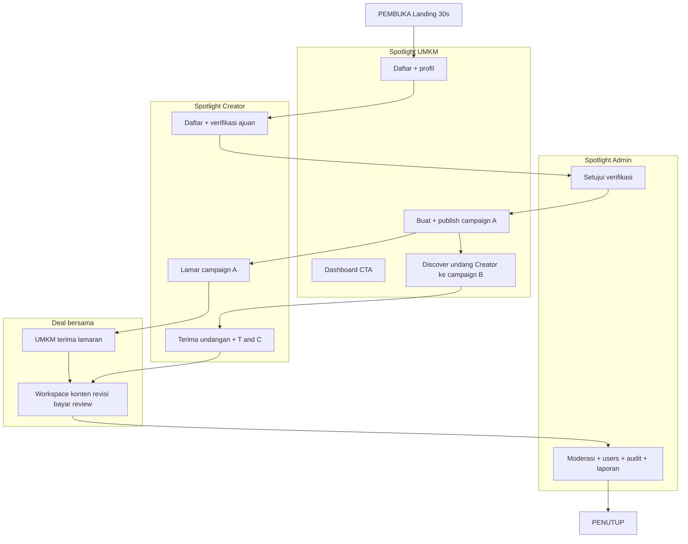

# Rencana Demo UI Collabite — Semua Role Kebagian

**Tanggal:** 2026-07-27  
**Status:** Disetujui opsi **A** (2026-07-27) — implementasi modul di `tests/E2E/demo/modules/` + orkestrator `demo-full-flow.spec.ts`.

---

## 1. Masalah hari ini

Aset yang sudah ada:

- Spec: [`tests/E2E/demo/demo-full-flow.spec.ts`](../../tests/E2E/demo/demo-full-flow.spec.ts)
- Config: [`playwright.demo.config.ts`](../../playwright.demo.config.ts)
- Jalankan: `npm run test:e2e:demo`

Kekurangan untuk presentasi “semua role kebagian”:

| Gap | Dampak |
|-----|--------|
| Hanya jalur **lamaran** (Creator → UMKM) | Alur **undangan** (UMKM Discover → Creator) tidak terlihat |
| Admin: verifikasi singkat di awal + tur halaman di akhir | Admin terasa “numpang”, bukan peran setara |
| UMKM/Creator: sedikit spotlight dashboard & inbox | Perbaikan CTA (Lamaran menunggu, next-step, pilih campaign) tidak masuk demo |
| Satu file panjang (~25 menit) | Sulit dipotong untuk UAS / slide / giliran anggota |

---

## 2. Prinsip demo

1. **Tiga portal = tiga spotlight** — tiap role punya minimal 1 babak “hero” (bukan hanya login).
2. **Dua jalur matchmaking** — tampilkan **lamaran** dan **undangan** (boleh dua campaign / dua deal singkat, atau undangan di babak terpisah).
3. **Narasi di layar** — lanjut pakai `narrate()` + overlay kursor (sudah ada).
4. **Modul opsional** — bisa jalan `full` atau per-modul (`umkm`, `creator`, `admin`, `invite`) agar anggota tim giliran merekam.
5. **Tidak ubah shell** — fokus UI alur bisnis + CTA yang sudah diperbaiki.

---

## 3. Struktur babak (rekomendasi)

Durasi target total **18–22 menit** (full). Versi singkat **12 menit** = skip modul undangan + potong admin tur.



### Alokasi waktu per role (full)

| Role | Babak | Menit (approx) | Yang wajib terlihat di UI |
|------|-------|----------------|---------------------------|
| **UMKM** | Daftar, dashboard, campaign, Discover+pilih campaign, terima lamaran, workspace (revisi/bayar/selesai) | ~7 | Dashboard “Lamaran menunggu”, Discover “Undang ke campaign mana?”, Terima+Tolak sejajar, next-step Konten |
| **Creator** | Daftar, verifikasi, Permintaan (undangan), Lamar, workspace (upload/revisi/konfirmasi bayar/review) | ~7 | Cari Campaign, Terima Undangan+T&C, tab Konten, next-step |
| **Admin** | Setujui verifikasi + tur moderasi nyata (bukan hanya scroll) | ~5 | Verifikasi Setujui, hide/show atau tinjau 1 item, Users, Collaborations, Audit, Reports |
| Shared | Landing + penutup | ~1–2 | Brand Collabite |

---

## 4. Modul implementasi (file)

Pecah demo menjadi modul yang bisa digabung:

| File | Isi |
|------|-----|
| `tests/E2E/demo/demo-helpers.ts` | Sudah ada — extend jika perlu `switchRole()`, `pauseScene()` |
| `tests/E2E/demo/modules/01-register-umkm.ts` | UMKM register + lengkapi profil |
| `tests/E2E/demo/modules/02-register-creator.ts` | Creator register + ajukan verifikasi |
| `tests/E2E/demo/modules/03-admin-verify.ts` | Admin setujui verifikasi (**hero Admin #1**) |
| `tests/E2E/demo/modules/04-umkm-campaign.ts` | Buat+publish campaign A; dashboard CTA |
| `tests/E2E/demo/modules/05-umkm-invite.ts` | Discover → pilih campaign → Kirim undangan (**hero UMKM undangan**) |
| `tests/E2E/demo/modules/06-creator-accept-invite.ts` | Permintaan → Terima Undangan + T&C |
| `tests/E2E/demo/modules/07-creator-apply.ts` | Lamar campaign A |
| `tests/E2E/demo/modules/08-umkm-accept-apply.ts` | Terima Lamaran + T&C |
| `tests/E2E/demo/modules/09-workspace-deal.ts` | Chat, progres, konten, revisi, bayar, selesai, review 2 arah |
| `tests/E2E/demo/modules/10-admin-oversight.ts` | Moderasi + users + collab + audit + reports (**hero Admin #2**) |
| `tests/E2E/demo/demo-full-flow.spec.ts` | Orkestrator: import semua modul berurutan |
| `tests/E2E/demo/demo-by-role.spec.ts` *(opsional)* | 3 test terpisah: hanya UMKM / Creator / Admin path dengan data seed |

**Env flags (disarankan):**

```bash
# Full
npm run test:e2e:demo

# Skip undangan (lebih pendek)
DEMO_SKIP_INVITE=1 npm run test:e2e:demo

# Tempo presentasi
DEMO_STEP_MS=3000 DEMO_SLOWMO=700 npm run test:e2e:demo
```

---

## 5. Checklist UI yang wajib masuk narasi

Setelah perbaikan CTA/layout terbaru:

- [ ] UMKM Dashboard → kartu **Lamaran menunggu** → `/umkm/campaigns?pending=1` (bukan kolaborasi kosong)
- [ ] Discover → **Undang ke campaign mana?** + tombol `Kirim undangan ke «…»`
- [ ] Terima Lamaran / Terima Undangan: checkbox T&C + **Terima ‖ Tolak** sejajar
- [ ] Collaboration Show: next-step **Buka Konten** (bukan “Buka Pesan” saat sudah di Pesan)
- [ ] Tab **Konten** (bukan Submission)
- [ ] Admin: minimal satu aksi nyata (setujui verifikasi) + satu halaman moderasi dengan konteks

---

## 6. Presentasi untuk kelompok (giliran role)

| Anggota / giliran | Modul | Durasi |
|-------------------|-------|--------|
| Presenter 1 | PEMBUKA + UMKM register + campaign + Discover undang | ~6 mnt |
| Presenter 2 | Creator register + terima undangan + lamar + workspace Creator | ~6 mnt |
| Presenter 3 | UMKM terima/revisi/bayar + Admin verifikasi & oversight + PENUTUP | ~6–8 mnt |

Atau rekam **satu video full** lalu potong di DaVinci/CapCut per babak `BABAK N — ROLE`.

---

## 7. Urutan kerja implementasi

1. **Spec approval** — dokumen ini disetujui (scope modul undangan: ya/tidak).
2. **Refactor** `demo-full-flow.spec.ts` → modul 01–10 + orkestrator (perilaku sama dulu).
3. **Tambah** modul undangan (05–06) + spotlight dashboard UMKM.
4. **Perkuat** modul Admin 10 (aksi nyata, bukan hanya `goto`).
5. **Dry-run** `npm run test:e2e:demo` headed; simpan video di `test-results/`.
6. **Cue card** 1 halaman untuk presenter (teks banner = yang dibaca).

---

## 8. Yang tidak masuk scope rencana ini

- Redesign visual / ganti shell ke top-nav.
- Demo mobile native / WebSocket realtime.
- Payment gateway nyata (cukup bukti transfer manual jika fitur aktif).

---

## 9. Keputusan yang diminta dari user

Sebelum implementasi, konfirmasi satu pilihan:

**A (direkomendasikan).** Full + undangan + admin 2 spotlight (verifikasi + oversight).  
**B.** Full tanpa undangan (hanya lamaran), admin tetap 2 spotlight.  
**C.** Tiga video terpisah per role (`demo-by-role.spec.ts`), data saling bergantung via seed/fixture.
